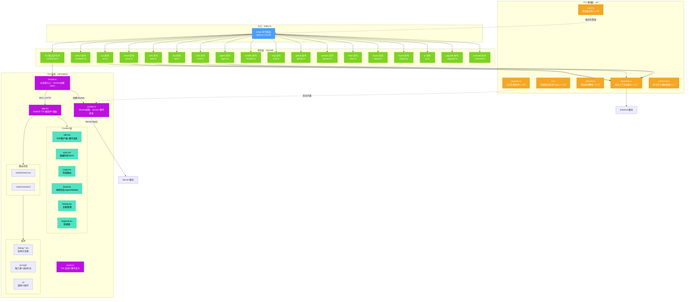
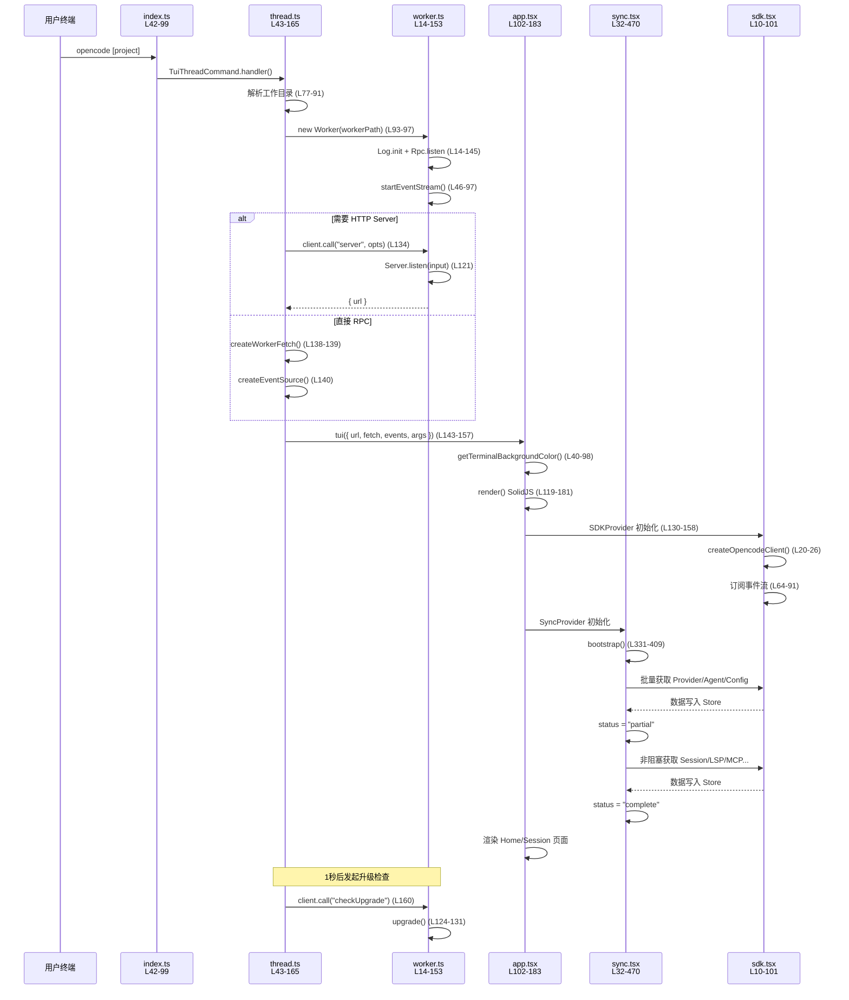
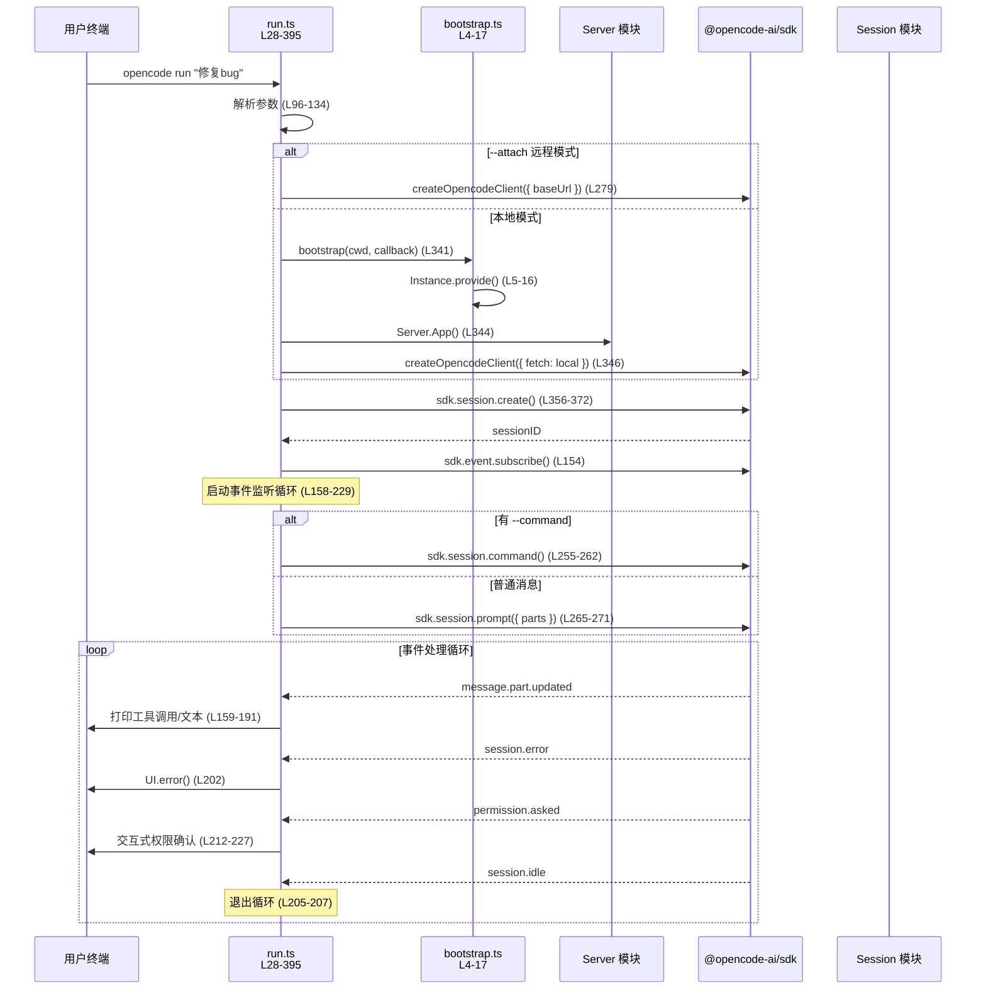
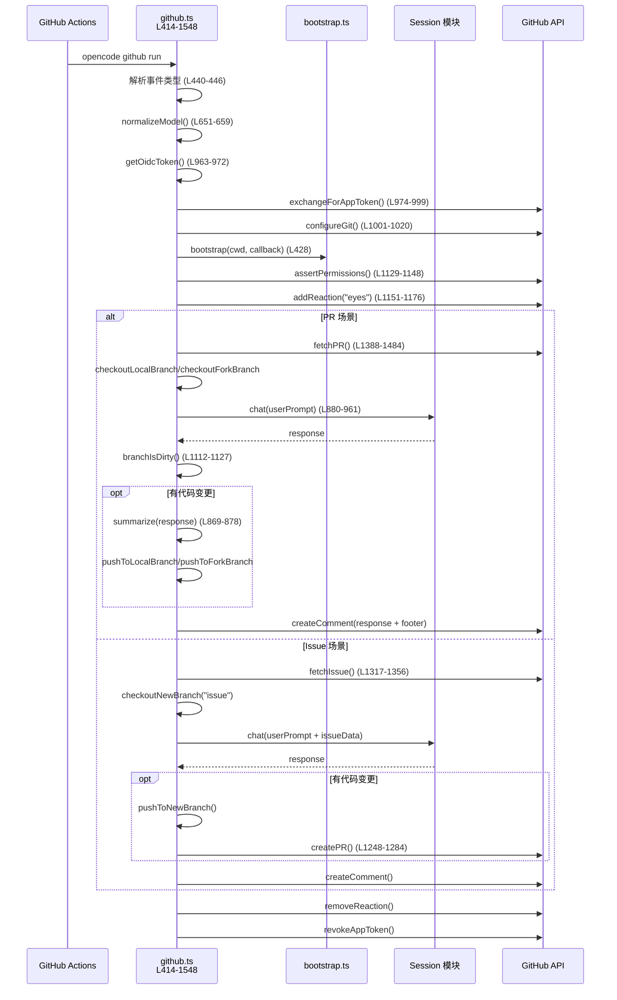
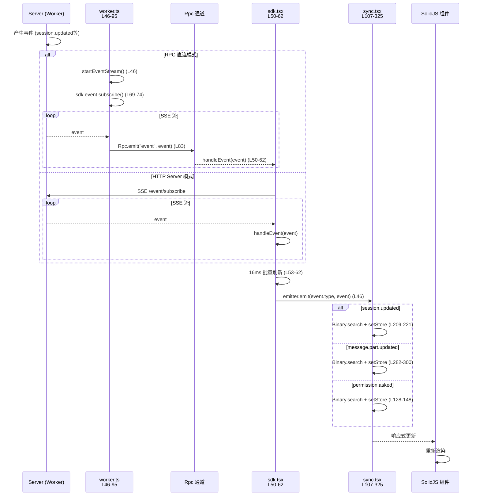
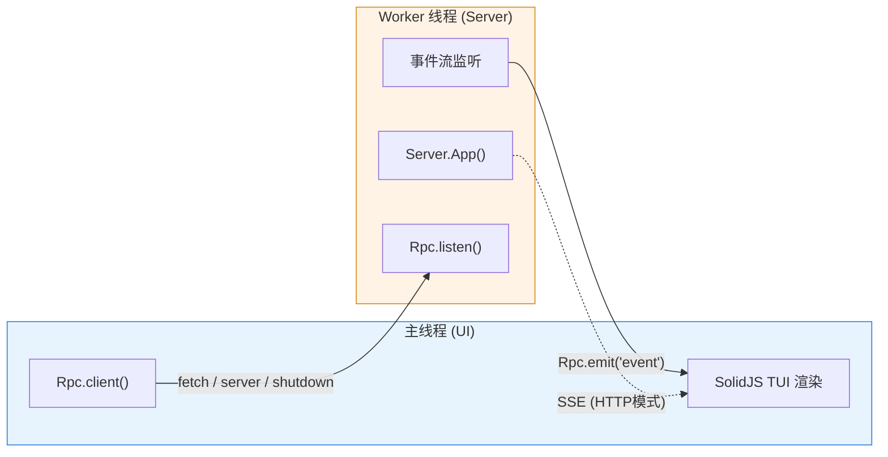

# CLI 模块源码分析

## 1. 模块功能简介

CLI 模块是 OpenCode 的**用户交互入口层**，负责将用户在终端输入的命令解析、路由到对应的功能模块执行。它包含两大交互范式：

● **命令行模式**（headless）：通过 `opencode run`、`opencode auth`、`opencode models` 等子命令，以传统 CLI 管道式方式完成一次性任务（发消息、管理凭证、列出模型等），输出到 stdout/stderr，适合脚本化和 CI 集成。

● **终端 UI 模式**（TUI）：默认启动的交互式全屏终端界面，基于 SolidJS + OpenTUI 渲染框架，在终端中提供富交互体验（会话列表、对话窗口、命令面板、主题切换等），通过 Worker 线程隔离后端服务和 UI 渲染。

核心职责：
● **命令注册与路由**：基于 yargs 定义所有 CLI 子命令（`$0` 默认 TUI、`run`、`serve`、`auth`、`models`、`mcp`、`github`、`agent` 等共 18+ 个命令），并统一处理参数解析与校验
● **项目引导（Bootstrap）**：通过 `Instance.provide()` 初始化项目上下文（配置、存储、Provider 等），为命令执行提供运行时环境
● **TUI 渲染引擎**：在独立 Worker 线程中运行 OpenCode Server，主线程通过 RPC 或 HTTP 与之通信，SolidJS 响应式 UI 实时展示会话数据
● **错误格式化**：将底层模块抛出的 NamedError 转换为用户友好的终端输出
● **自动升级**：后台检测新版本并按配置自动/通知升级
● **GitHub CI 集成**：`opencode github run` 在 GitHub Actions 中运行 Agent，自动处理 Issue/PR 评论、代码推送与 PR 创建

---

## 2. 系统架构图



**架构说明：**
- **入口层**（index.ts）：使用 yargs 注册所有子命令，统一处理参数解析、日志初始化和全局错误捕获
- **CLI 基础层**：提供项目引导（bootstrap）、终端样式输出（UI）、错误格式化、网络选项等公共能力
- **命令层**：18+ 个独立命令模块，各自定义 builder/handler，按功能分为交互式（TUI/Attach）、任务式（run/serve/web）、管理式（auth/models/mcp/agent）、CI 式（github）等
- **TUI 系统**：最复杂的子系统，主线程（thread.ts）创建 Worker 线程运行 Server，通过 RPC 通信；SolidJS 渲染引擎在主线程运行，通过 Context 层管理 SDK 连接、数据同步、路由、本地状态等

---

## 3. 源码目录结构

```
packages/opencode/src/cli/
├── bootstrap.ts              # 项目上下文引导：Instance.provide() 包装
├── ui.ts                     # 终端输出工具：样式常量、print/logo/input/error
├── error.ts                  # 错误格式化：将 NamedError 转为用户友好文本
├── logo.ts                   # ASCII Logo 字符定义
├── network.ts                # 网络选项：port/hostname/mdns/cors 解析
├── upgrade.ts                # 自动升级：检测最新版并按配置升级/通知
└── cmd/                      # 所有子命令
    ├── cmd.ts                # cmd() 辅助函数，统一命令定义类型
    ├── run.ts                # `opencode run`：非交互式发送消息并订阅事件流
    ├── serve.ts              # `opencode serve`：启动无头 HTTP Server
    ├── web.ts                # `opencode web`：启动 Server 并打开浏览器
    ├── acp.ts                # `opencode acp`：Agent Client Protocol 服务端
    ├── auth.ts               # `opencode auth`：凭证管理 (login/logout/list)
    ├── agent.ts              # `opencode agent`：Agent 管理 (create/list)
    ├── models.ts             # `opencode models`：列出可用模型
    ├── mcp.ts                # `opencode mcp`：MCP 服务器管理 (add/list/auth/logout/debug)
    ├── github.ts             # `opencode github`：GitHub CI 集成 (install/run)
    ├── session.ts            # `opencode session`：会话管理 (list)
    ├── stats.ts              # `opencode stats`：Token 用量和成本统计
    ├── export.ts             # `opencode export`：导出会话为 JSON
    ├── import.ts             # `opencode import`：从 JSON 文件或 URL 导入会话
    ├── pr.ts                 # `opencode pr`：拉取并 checkout GitHub PR
    ├── generate.ts           # `opencode generate`：生成 OpenAPI 规范
    ├── upgrade.ts            # `opencode upgrade`：手动升级
    ├── uninstall.ts          # `opencode uninstall`：完整卸载
    ├── debug/                # `opencode debug`：调试子命令集合
    │   ├── index.ts          # debug 命令注册入口
    │   ├── agent.ts          # 调试 Agent
    │   ├── config.ts         # 调试配置
    │   ├── file.ts           # 调试文件
    │   ├── lsp.ts            # 调试 LSP
    │   ├── ripgrep.ts        # 调试 ripgrep
    │   ├── scrap.ts          # 调试 scratchpad
    │   ├── skill.ts          # 调试 Skill
    │   └── snapshot.ts       # 调试快照
    └── tui/                  # TUI 交互式终端界面
        ├── thread.ts         # 主线程入口：创建 Worker、RPC 通信、启动 TUI
        ├── worker.ts         # Worker 线程：运行 Server、事件流转发、RPC 监听
        ├── app.tsx           # SolidJS 根组件：Provider 嵌套、路由、命令面板
        ├── attach.ts         # attach 命令：连接远程 Server
        ├── event.ts          # TUI 自定义事件类型定义
        ├── context/          # SolidJS Context 提供者
        │   ├── sdk.tsx       # SDK 客户端与事件总线
        │   ├── sync.tsx      # 数据同步 Store（会话/消息/Provider 等）
        │   ├── route.tsx     # 页面路由管理
        │   ├── local.tsx     # 本地状态（当前 Agent/Model/MCP 切换）
        │   ├── theme.tsx     # 主题管理
        │   ├── theme/        # 30+ 主题 JSON 文件
        │   ├── keybind.tsx   # 快捷键绑定
        │   ├── kv.tsx        # 键值存储
        │   ├── exit.tsx      # 退出处理
        │   ├── helper.tsx    # Context 创建辅助
        │   ├── args.tsx      # 命令行参数传递
        │   ├── directory.ts  # 目录上下文
        │   ├── prompt.tsx    # 输入框 Ref
        │   └── sync.tsx      # 服务端状态同步
        ├── routes/           # 路由页面
        │   ├── home.tsx      # 首页（会话列表/新建）
        │   └── session/      # 会话详情页
        │       ├── index.tsx     # 会话页面主入口
        │       ├── header.tsx    # 会话头部
        │       ├── footer.tsx    # 会话底部（输入区）
        │       ├── sidebar.tsx   # 侧边栏
        │       ├── permission.tsx # 权限请求弹窗
        │       ├── question.tsx  # 问题请求弹窗
        │       ├── dialog-message.tsx      # 消息详情对话框
        │       ├── dialog-timeline.tsx     # 时间线对话框
        │       ├── dialog-subagent.tsx     # 子Agent对话框
        │       └── dialog-fork-from-timeline.tsx # 分叉对话框
        ├── component/        # 通用组件
        │   ├── prompt/       # 输入框组件
        │   │   ├── index.tsx       # 输入框主组件
        │   │   ├── autocomplete.tsx # 自动补全
        │   │   ├── frecency.tsx    # 频率排序
        │   │   ├── history.tsx     # 历史记录
        │   │   └── stash.tsx       # 暂存
        │   ├── dialog-agent.tsx          # Agent 选择器
        │   ├── dialog-command.tsx        # 命令面板
        │   ├── dialog-mcp.tsx            # MCP 管理
        │   ├── dialog-model.tsx          # 模型选择器
        │   ├── dialog-provider.tsx       # Provider 连接
        │   ├── dialog-session-list.tsx   # 会话列表
        │   ├── dialog-session-rename.tsx # 会话重命名
        │   ├── dialog-skill.tsx          # Skill 对话框
        │   ├── dialog-stash.tsx          # 暂存对话框
        │   ├── dialog-status.tsx         # 状态面板
        │   ├── dialog-tag.tsx            # 标签对话框
        │   ├── dialog-theme-list.tsx     # 主题选择器
        │   ├── border.tsx                # 边框组件
        │   ├── logo.tsx                  # Logo 组件
        │   ├── tips.tsx                  # 提示文本
        │   ├── todo-item.tsx             # Todo 项
        │   └── textarea-keybindings.ts   # 文本区快捷键
        ├── ui/               # 基础 UI 组件
        │   ├── dialog.tsx          # 对话框基础框架
        │   ├── dialog-alert.tsx    # 警告对话框
        │   ├── dialog-confirm.tsx  # 确认对话框
        │   ├── dialog-export-options.tsx # 导出选项
        │   ├── dialog-help.tsx     # 帮助对话框
        │   ├── dialog-prompt.tsx   # 输入对话框
        │   ├── dialog-select.tsx   # 选择对话框
        │   ├── link.tsx            # 链接组件
        │   ├── spinner.ts          # 加载动画
        │   └── toast.tsx           # Toast 通知
        └── util/             # TUI 工具函数
            ├── clipboard.ts        # 剪贴板操作
            ├── editor.ts           # 外部编辑器
            ├── signal.ts           # 信号处理
            ├── terminal.ts         # 终端工具
            └── transcript.ts       # 会话记录
```

**重要文件说明：**

● **index.ts**（项目根 src/index.ts）：整个 CLI 的顶层入口，使用 yargs 注册所有命令，配置全局中间件（日志初始化）、错误处理和 shell 补全。

● **bootstrap.ts**：关键的项目上下文初始化函数，包裹 `Instance.provide()` + `InstanceBootstrap`，确保命令执行时 Config、Storage、Provider 等子系统就绪；几乎所有需要访问项目数据的命令都通过它引导。

● **cmd/cmd.ts**：仅 7 行的辅助函数 `cmd()`，为 yargs CommandModule 添加 `--` 双横线参数类型支持。

● **cmd/tui/thread.ts**：TUI 的主线程入口，创建 Worker 线程、建立 RPC 通信、解析网络选项后决定走 HTTP Server 模式还是直接 RPC 模式，最终调用 `tui()` 启动界面。

● **cmd/tui/worker.ts**：在 Worker 线程中运行，初始化日志、订阅全局事件总线并通过 RPC 转发，暴露 `fetch`/`server`/`checkUpgrade`/`reload`/`shutdown` 等 RPC 方法。

● **cmd/tui/app.tsx**：TUI 的 SolidJS 根组件，嵌套 15 层 Context Provider（Args→Exit→KV→Toast→Route→SDK→Sync→Theme→Local→Keybind→PromptStash→Dialog→Command→Frecency→PromptHistory→PromptRef），以及 App 组件中注册命令面板条目和事件监听。

● **cmd/tui/context/sync.tsx**：最核心的数据同步层，bootstrap 时从 SDK 批量获取 Provider/Agent/Session/Config 等数据写入 SolidJS Store，并监听 SSE 事件实时增量更新。

● **cmd/github.ts**：最大的单文件（1500+ 行），完整实现了 GitHub Actions 集成 Agent，包括 OIDC 认证、Issue/PR 评论处理、分支管理、代码推送、PR 创建等。

---

## 4. 核心数据结构

### 4.1 命令定义辅助类型

```typescript
// cmd/cmd.ts L1-7
import type { CommandModule } from "yargs"

type WithDoubleDash<T> = T & { "--"?: string[] }

export function cmd<T, U>(input: CommandModule<T, WithDoubleDash<U>>) {
  return input
}
```

**说明：** 统一的命令定义辅助函数。`WithDoubleDash` 扩展了 yargs 的参数类型，支持 `--` 后的透传参数。所有子命令都通过 `cmd()` 包装以获得类型安全。

### 4.2 TUI 路由类型

```typescript
// cmd/tui/context/route.tsx L5-16
export type HomeRoute = {
  type: "home"
  initialPrompt?: PromptInfo
}

export type SessionRoute = {
  type: "session"
  sessionID: string
  initialPrompt?: PromptInfo
}

export type Route = HomeRoute | SessionRoute
```

**说明：** TUI 只有两个页面路由——首页（Home）和会话详情页（Session）。通过 `type` 字段区分，`SessionRoute` 携带 `sessionID` 用于加载对应会话数据。`initialPrompt` 支持从首页切换时保留已输入的提示文本。

### 4.3 TUI 自定义事件

```typescript
// cmd/tui/event.ts L5-48
export const TuiEvent = {
  PromptAppend: BusEvent.define("tui.prompt.append",
    z.object({ text: z.string() })),

  CommandExecute: BusEvent.define("tui.command.execute",
    z.object({
      command: z.union([
        z.enum(["session.list", "session.new", "session.share",
                 "session.interrupt", "session.compact",
                 "session.page.up", "session.page.down", ...]),
        z.string(),
      ]),
    })),

  ToastShow: BusEvent.define("tui.toast.show",
    z.object({
      title: z.string().optional(),
      message: z.string(),
      variant: z.enum(["info", "success", "warning", "error"]),
      duration: z.number().default(5000).optional(),
    })),

  SessionSelect: BusEvent.define("tui.session.select",
    z.object({
      sessionID: z.string().regex(/^ses/),
    })),
}
```

**说明：** TUI 自定义的 4 种事件类型，全部通过 `BusEvent.define()` 定义并使用 Zod 校验。这些事件在 Worker 和 TUI 主线程之间流转：
- `PromptAppend`：向输入框追加文本
- `CommandExecute`：触发命令面板中的命令
- `ToastShow`：显示 Toast 通知
- `SessionSelect`：导航到指定会话

### 4.4 Sync Store 数据结构

```typescript
// cmd/tui/context/sync.tsx L35-103 (简化)
const [store, setStore] = createStore<{
  status: "loading" | "partial" | "complete"
  provider: Provider[]
  provider_default: Record<string, string>
  provider_auth: Record<string, ProviderAuthMethod[]>
  agent: Agent[]
  command: Command[]
  permission: { [sessionID: string]: PermissionRequest[] }
  question: { [sessionID: string]: QuestionRequest[] }
  config: Config
  session: Session[]
  session_status: { [sessionID: string]: SessionStatus }
  session_diff: { [sessionID: string]: Snapshot.FileDiff[] }
  todo: { [sessionID: string]: Todo[] }
  message: { [sessionID: string]: Message[] }
  part: { [messageID: string]: Part[] }
  lsp: LspStatus[]
  mcp: { [key: string]: McpStatus }
  formatter: FormatterStatus[]
  vcs: VcsInfo | undefined
  path: Path
}>
```

**说明：** TUI 最核心的数据 Store，使用 SolidJS 的 `createStore` 创建响应式状态。包含：
- **status**：三阶段加载状态（loading → partial → complete），`partial` 时核心数据（Provider/Agent/Config）已就绪，`complete` 时所有非关键数据（Session 列表、LSP/MCP 状态等）也已加载
- **provider/agent/command**：全局配置性数据，bootstrap 时一次性获取
- **session/message/part**：按 sessionID 索引的会话树结构，消息最多缓存 100 条
- **permission/question**：按 sessionID 索引的待处理权限/问题请求队列
- **todo/session_diff**：按 sessionID 索引的待办事项和文件变更

### 4.5 网络选项类型

```typescript
// network.ts L4-26
const options = {
  port: { type: "number" as const, default: 0 },
  hostname: { type: "string" as const, default: "127.0.0.1" },
  mdns: { type: "boolean" as const, default: false },
  cors: { type: "string" as const, array: true, default: [] as string[] },
}

export type NetworkOptions = InferredOptionTypes<typeof options>
```

**说明：** 多个命令（serve/web/tui/acp）共享的网络选项，支持 CLI 参数和全局配置文件两级优先级。`resolveNetworkOptions()` 按 "CLI参数 > 全局配置 > 默认值" 的优先级合并。

### 4.6 UI 样式常量

```typescript
// ui.ts L9-24
export const Style = {
  TEXT_HIGHLIGHT: "\x1b[96m",
  TEXT_HIGHLIGHT_BOLD: "\x1b[96m\x1b[1m",
  TEXT_DIM: "\x1b[90m",
  TEXT_DIM_BOLD: "\x1b[90m\x1b[1m",
  TEXT_NORMAL: "\x1b[0m",
  TEXT_NORMAL_BOLD: "\x1b[1m",
  TEXT_WARNING: "\x1b[93m",
  TEXT_WARNING_BOLD: "\x1b[93m\x1b[1m",
  TEXT_DANGER: "\x1b[91m",
  TEXT_DANGER_BOLD: "\x1b[91m\x1b[1m",
  TEXT_SUCCESS: "\x1b[92m",
  TEXT_SUCCESS_BOLD: "\x1b[92m\x1b[1m",
  TEXT_INFO: "\x1b[94m",
  TEXT_INFO_BOLD: "\x1b[94m\x1b[1m",
}
```

**说明：** ANSI 终端样式常量集，在命令行模式中广泛使用。提供高亮、暗色、警告、危险、成功、信息六种语义色及其粗体变体，用于统一 CLI 输出风格。

---

## 5. 核心工作场景时序图

### 5.1 TUI 启动流程（默认 `opencode` 命令）



**说明：** TUI 启动分为三个阶段：
1. **Worker 启动**：主线程创建 Worker，Worker 中初始化日志、启动事件流监听、注册 RPC 方法
2. **通信建立**：根据网络选项决定通过 HTTP Server 还是 RPC 直连
3. **UI 渲染**：SolidJS 渲染框架启动后，通过 SyncProvider 的 bootstrap 分阶段加载数据（先关键数据后非关键数据），实现快速首屏渲染

### 5.2 `opencode run` 非交互式执行流程



**说明：** `run` 命令支持两种后端模式：
- **本地模式**：通过 `bootstrap()` 初始化项目上下文，直接调用 `Server.App().fetch()` 作为 SDK 的 fetch 实现，无需启动 HTTP Server
- **远程模式**（`--attach`）：连接到已运行的 OpenCode Server

执行流程为：创建会话 → 订阅 SSE 事件流 → 发送消息/命令 → 循环处理事件（打印工具调用、文本、错误、权限请求）→ 收到 `session.idle` 退出。

### 5.3 GitHub CI 集成流程



**说明：** GitHub 集成是最复杂的命令，完整流程包括：
1. **认证**：通过 OIDC 令牌换取 GitHub App Token
2. **权限检查**：验证触发者是否有写权限
3. **分支管理**：根据事件类型（Issue/PR/Fork PR）切换到对应分支
4. **Agent 对话**：发送含 GitHub 上下文的 prompt，获取 Agent 回复
5. **代码推送**：如有变更自动 commit 和 push
6. **反馈**：在 Issue/PR 上创建评论、管理 reaction
7. **清理**：恢复 git 配置、撤销 App Token

### 5.4 TUI 事件同步流程



**说明：** 事件同步是 TUI 实时更新的核心机制：
- **两种通信模式**：RPC 直连（无 HTTP 开销）或 HTTP SSE（支持远程连接）
- **事件批量处理**：SDK 层使用 16ms 定时器聚合事件，减少渲染次数
- **高效 Store 更新**：Sync 层使用 `Binary.search` 在有序数组中定位数据，通过 `produce`/`reconcile` 精确更新，最小化 SolidJS 的响应式触发

---

## 6. 其他必要说明

### 6.1 双线程架构



**说明：** OpenCode TUI 采用双线程架构将 UI 渲染和后端服务完全隔离：
- **主线程**：运行 SolidJS + OpenTUI 渲染引擎，负责终端 UI 绘制和用户交互
- **Worker 线程**：运行 OpenCode Server（含 AI 推理、工具执行、文件操作等），通过 RPC 或 HTTP 提供服务

这种设计确保了 AI 推理等计算密集型操作不会阻塞 UI 渲染，同时 Worker 中的 GlobalBus 事件通过 RPC 透传到主线程驱动实时更新。

### 6.2 命令分类总览

| 类别 | 命令 | 说明 |
|------|------|------|
| **交互式** | `$0` (TUI), `attach` | 全屏终端 UI |
| **任务执行** | `run` | 非交互式发送消息 |
| **服务器** | `serve`, `web`, `acp` | 启动 HTTP/Web/ACP 服务 |
| **凭证管理** | `auth login/logout/list` | Provider 认证 |
| **资源管理** | `models`, `agent create/list`, `mcp add/list/auth/logout/debug` | 模型/Agent/MCP 管理 |
| **会话管理** | `session list`, `export`, `import` | 会话列表/导出/导入 |
| **CI 集成** | `github install/run`, `pr` | GitHub Actions 集成 |
| **统计** | `stats` | Token 用量和成本统计 |
| **维护** | `upgrade`, `uninstall`, `debug`, `generate` | 升级/卸载/调试/生成 |

### 6.3 SolidJS Context Provider 嵌套顺序

TUI 的 Context Provider 按严格依赖顺序嵌套（`app.tsx` L119-163）：

```
ErrorBoundary
  └── ArgsProvider          # 命令行参数
    └── ExitProvider        # 退出处理
      └── KVProvider        # 键值存储
        └── ToastProvider   # Toast 通知
          └── RouteProvider # 路由状态
            └── SDKProvider # SDK + 事件总线
              └── SyncProvider    # 数据同步
                └── ThemeProvider # 主题
                  └── LocalProvider     # 本地状态
                    └── KeybindProvider # 快捷键
                      └── PromptStashProvider # 暂存
                        └── DialogProvider    # 对话框
                          └── CommandProvider # 命令面板
                            └── FrecencyProvider    # 频率排序
                              └── PromptHistoryProvider # 历史
                                └── PromptRefProvider   # 输入Ref
                                  └── App
```

内层 Provider 可以 `use*()` 访问外层的 Context，因此依赖关系从外到内递增。例如 `SyncProvider` 依赖 `SDKProvider` 和 `ExitProvider`，`LocalProvider` 依赖 `SyncProvider` 和 `ThemeProvider`。
