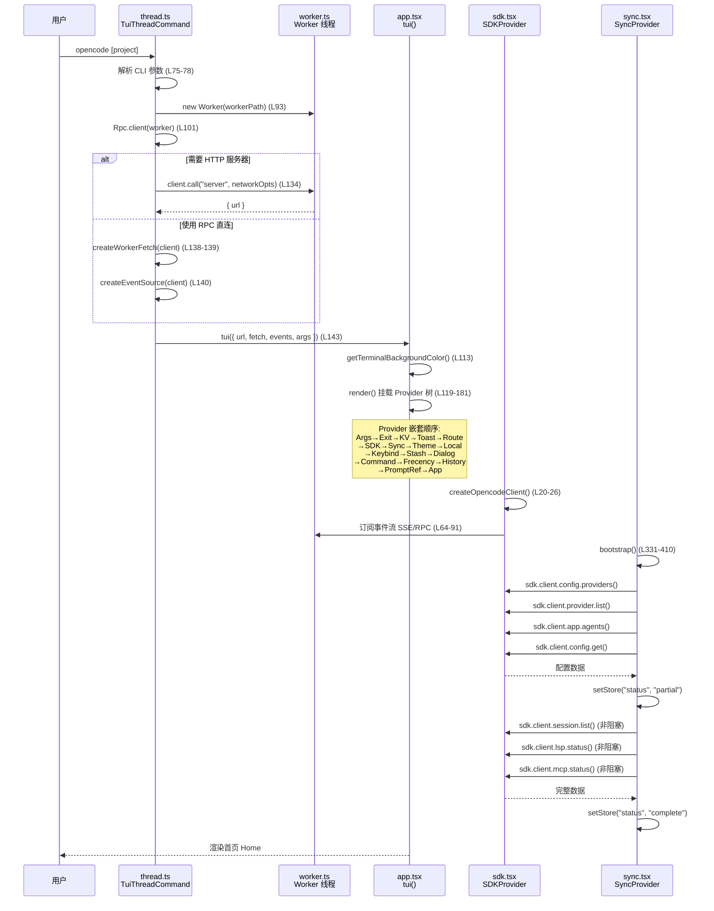
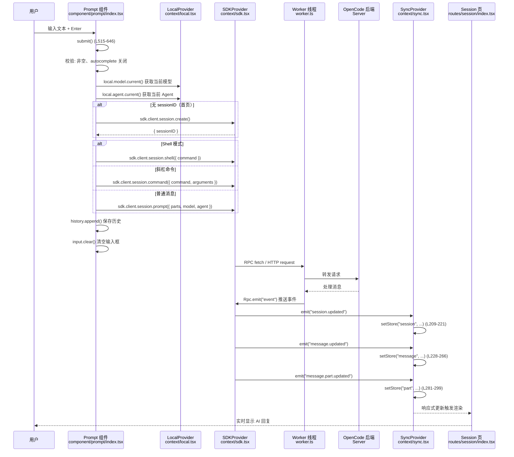
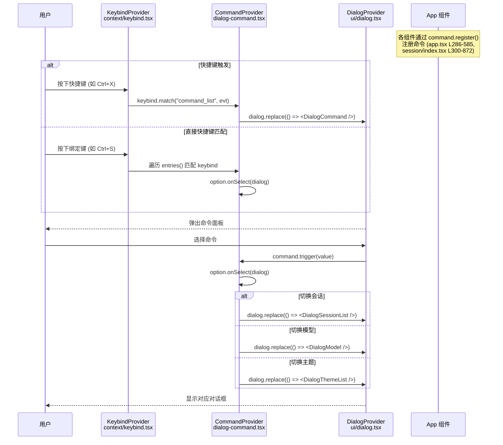
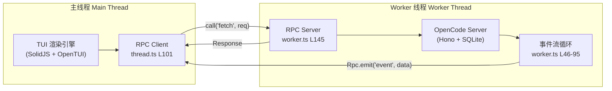

# TUI 模块源码分析

> 模块路径：`packages/opencode/src/cli/cmd/tui/`

---

## 1. 模块功能简介

TUI（Terminal User Interface）模块是 OpenCode 的终端交互式用户界面层，基于 **SolidJS + OpenTUI** 构建，负责：

- **提供完整的终端 UI 体验**：在终端中渲染可交互的图形界面，包括路由页面（首页 / 会话页）、弹窗对话框、命令面板、自动补全提示等
- **维护前端响应式状态**：通过多层嵌套的 Context Provider 实现全局状态管理，包括 SDK 客户端、数据同步、本地偏好、主题、快捷键、路由等
- **Worker 双进程架构**：主线程负责 UI 渲染，Worker 线程运行 OpenCode 后端服务器，两者通过 RPC 通信，实现 UI 与业务逻辑的解耦
- **事件驱动的数据同步**：通过 SSE 或 RPC 事件流实时订阅后端状态变更（会话、消息、权限、MCP 状态等），并以 SolidJS 响应式 Store 批量更新 UI
- **丰富的交互能力**：支持命令面板（Ctrl+X）、斜杠命令（/sessions, /models 等）、快捷键系统、剪贴板操作、图片粘贴、Shell 模式、外部编辑器集成等

---

## 2. 系统架构图

```mermaid
graph TB
    subgraph "主线程 (UI)"
        CLI["CLI 入口<br/>thread.ts L43-165"]
        TUI["tui() 渲染入口<br/>app.tsx L102-183"]

        subgraph "Context Provider 层"
            direction TB
            Args["ArgsProvider"]
            Exit["ExitProvider"]
            KV["KVProvider"]
            Toast["ToastProvider"]
            Route["RouteProvider<br/>route.tsx"]
            SDK["SDKProvider<br/>sdk.tsx"]
            Sync["SyncProvider<br/>sync.tsx"]
            Theme["ThemeProvider<br/>theme.tsx"]
            Local["LocalProvider<br/>local.tsx"]
            Keybind["KeybindProvider<br/>keybind.tsx"]
            Stash["PromptStashProvider"]
            Dialog["DialogProvider<br/>dialog.tsx"]
            Command["CommandProvider<br/>dialog-command.tsx"]
            Frecency["FrecencyProvider"]
            History["PromptHistoryProvider"]
            PromptRef["PromptRefProvider"]
        end

        subgraph "路由页面"
            Home["Home 首页<br/>routes/home.tsx"]
            Session["Session 会话页<br/>routes/session/index.tsx"]
        end

        subgraph "UI 组件"
            Prompt["Prompt 输入框<br/>component/prompt/index.tsx"]
            Dialogs["对话框系列<br/>component/dialog-*.tsx"]
            Header["Header 顶栏<br/>routes/session/header.tsx"]
            Sidebar["Sidebar 侧栏<br/>routes/session/sidebar.tsx"]
            Messages["消息渲染<br/>UserMessage / AssistantMessage"]
            ToolParts["工具结果渲染<br/>Bash/Edit/Write/Read..."]
        end

        App["App 主组件<br/>app.tsx L185-691"]
    end

    subgraph "Worker 线程 (后端)"
        Worker["worker.ts L1-153"]
        Server["Server 实例<br/>server/server.ts"]
        Instance["Project Instance<br/>project/instance.ts"]
        EventStream["事件流<br/>worker.ts L46-95"]
    end

    CLI -->|"创建 Worker"| Worker
    CLI -->|"RPC.client"| TUI
    TUI --> App
    App --> Home
    App --> Session

    SDK -->|"SSE / RPC 事件流"| Sync
    Sync -->|"响应式 Store"| Session
    Sync -->|"响应式 Store"| Home

    Worker -->|"RPC.emit('event')"| SDK
    Worker --> Server
    Worker --> Instance
    EventStream -->|"订阅后端事件"| Worker

    Session --> Prompt
    Session --> Header
    Session --> Sidebar
    Session --> Messages
    Messages --> ToolParts
    Home --> Prompt

    Prompt -->|"sdk.client.session.prompt()"| SDK
    Dialogs -->|"sdk.client.*"| SDK
```



**说明**：TUI 采用经典的 Provider 嵌套模式管理上下文，从外到内依次是参数 → 退出 → KV 存储 → Toast → 路由 → SDK → 数据同步 → 主题 → 本地偏好 → 快捷键 → 弹窗 → 命令面板 → 输入历史。主线程与 Worker 线程通过 `Rpc` 模块通信，Worker 内部运行 OpenCode 后端服务器并向 UI 推送实时事件。

---

## 3. 源码目录结构

```
packages/opencode/src/cli/cmd/tui/
├── app.tsx                    # TUI 入口：tui() 函数 + App 主组件 + Provider 嵌套
├── thread.ts                  # CLI 命令入口：创建 Worker、解析参数、启动 TUI
├── worker.ts                  # Worker 线程：运行后端服务器、RPC 监听、事件流转发
├── attach.ts                  # attach 子命令：连接远程 OpenCode 服务器
├── event.ts                   # TUI 自定义事件定义（PromptAppend, CommandExecute 等）
├── component/                 # 可复用组件
│   ├── prompt/                # 输入框组件
│   │   ├── index.tsx          # Prompt 主组件（输入、提交、斜杠命令、Shell 模式）
│   │   ├── autocomplete.tsx   # 自动补全弹出层
│   │   ├── frecency.tsx       # 频率+近期 排序算法
│   │   ├── history.tsx        # 输入历史管理
│   │   └── stash.tsx          # 输入暂存
│   ├── border.tsx             # 自定义边框字符
│   ├── logo.tsx               # OpenCode Logo
│   ├── tips.tsx               # 使用提示
│   ├── todo-item.tsx          # Todo 条目渲染
│   ├── textarea-keybindings.ts # Textarea 快捷键映射
│   ├── dialog-agent.tsx       # Agent 选择对话框
│   ├── dialog-command.tsx     # 命令面板（Ctrl+X）
│   ├── dialog-mcp.tsx         # MCP 状态对话框
│   ├── dialog-model.tsx       # 模型选择对话框
│   ├── dialog-provider.tsx    # Provider 连接对话框
│   ├── dialog-session-list.tsx # 会话列表对话框
│   ├── dialog-session-rename.tsx # 会话重命名对话框
│   ├── dialog-skill.tsx       # Skill 选择对话框
│   ├── dialog-stash.tsx       # 暂存列表对话框
│   ├── dialog-status.tsx      # 系统状态对话框
│   ├── dialog-tag.tsx         # Tag 对话框
│   └── dialog-theme-list.tsx  # 主题列表对话框
├── context/                   # Context Provider（全局状态管理）
│   ├── helper.tsx             # createSimpleContext 工厂函数
│   ├── args.tsx               # CLI 参数上下文
│   ├── directory.ts           # 当前目录上下文
│   ├── exit.tsx               # 退出处理上下文
│   ├── keybind.tsx            # 快捷键上下文（解析、匹配、leader key）
│   ├── kv.tsx                 # KV 本地存储上下文
│   ├── local.tsx              # 本地偏好上下文（agent、model、mcp 选择）
│   ├── prompt.tsx             # Prompt Ref 上下文
│   ├── route.tsx              # 路由上下文（home / session）
│   ├── sdk.tsx                # SDK 客户端上下文（事件订阅、请求代理）
│   ├── sync.tsx               # 数据同步上下文（核心 Store，监听所有后端事件）
│   ├── theme.tsx              # 主题上下文（30+ 内置主题 + 自定义主题）
│   └── theme/                 # 主题 JSON 文件（aura, catppuccin, dracula 等 32 套）
│       └── *.json
├── routes/                    # 路由页面
│   ├── home.tsx               # 首页（Logo + Prompt + Tips）
│   └── session/               # 会话页
│       ├── index.tsx          # 会话主组件（消息列表、工具渲染、滚动控制）
│       ├── header.tsx         # 会话头部（标题、Token 统计、费用）
│       ├── footer.tsx         # 会话底部（目录、LSP/MCP 状态）
│       ├── sidebar.tsx        # 侧边栏（文件变更、子会话等）
│       ├── permission.tsx     # 权限请求弹窗
│       ├── question.tsx       # 问题请求弹窗
│       ├── dialog-message.tsx # 消息操作对话框
│       ├── dialog-timeline.tsx # 时间线跳转对话框
│       ├── dialog-fork-from-timeline.tsx # Fork 会话对话框
│       └── dialog-subagent.tsx # 子 Agent 对话框
├── ui/                        # 底层 UI 原语
│   ├── dialog.tsx             # Dialog 容器 + DialogProvider（堆栈管理）
│   ├── dialog-alert.tsx       # Alert 对话框
│   ├── dialog-confirm.tsx     # 确认对话框
│   ├── dialog-export-options.tsx # 导出选项对话框
│   ├── dialog-help.tsx        # 帮助对话框
│   ├── dialog-prompt.tsx      # 文本输入对话框
│   ├── dialog-select.tsx      # 列表选择对话框
│   ├── link.tsx               # 超链接组件
│   ├── spinner.ts             # 加载动画
│   └── toast.tsx              # Toast 通知
└── util/                      # 工具函数
    ├── clipboard.ts           # 剪贴板读写
    ├── editor.ts              # 外部编辑器集成
    ├── signal.ts              # Signal 工具
    ├── terminal.ts            # 终端工具
    └── transcript.ts          # 会话导出格式化
```

**重要文件说明**：

- **app.tsx**：TUI 的核心入口，定义了 `tui()` 函数（Provider 嵌套树）和 `App` 主组件（路由分发、命令注册、全局事件监听）
- **thread.ts**：CLI `$0` 默认命令的处理器，负责创建 Worker 线程、解析 CLI 参数、建立 RPC 通信，是 TUI 的启动引导文件
- **worker.ts**：在独立 Worker 线程中运行 OpenCode 后端服务器，提供 `fetch`/`server`/`shutdown` 等 RPC 方法，并将后端事件通过 `Rpc.emit` 转发给主线程
- **context/sync.tsx**：最核心的数据同步层，维护一个包含所有后端数据的 SolidJS Store（sessions、messages、parts、permissions 等），监听 SDK 事件流并进行增量更新
- **context/sdk.tsx**：封装 `@opencode-ai/sdk` 客户端，提供事件 Emitter，统一管理 SSE 连接和事件批处理
- **context/local.tsx**：管理用户的本地偏好，包括当前 Agent 选择、Model 选择（含 recent/favorite 列表）、MCP 开关等
- **component/prompt/index.tsx**：Prompt 输入框的完整实现，处理文本输入、文件粘贴、斜杠命令、Shell 模式、提交逻辑等
- **component/dialog-command.tsx**：命令面板系统，支持注册/触发命令、快捷键绑定、斜杠命令、分类展示

---

## 4. 核心数据结构

### 4.1 路由状态 — `Route`

```typescript
// context/route.tsx L5-16
export type HomeRoute = {
  type: "home"
  initialPrompt?: PromptInfo
}

export type SessionRoute = {
  type: "session"
  sessionID: string
  initialPrompt?: PromptInfo
}

export type Route = HomeRoute | SessionRoute
```

**说明**：TUI 只有两个路由页面 —— `home`（首页）和 `session`（会话页）。路由状态通过 `createStore` 管理，`navigate()` 方法直接设置新路由。`initialPrompt` 用于在路由切换时携带初始输入内容（如从 Fork 或新建会话）。

### 4.2 全局同步 Store — `SyncProvider` 中的 Store

```typescript
// context/sync.tsx L35-103
const [store, setStore] = createStore<{
  status: "loading" | "partial" | "complete"
  provider: Provider[]
  provider_default: Record<string, string>
  provider_next: ProviderListResponse
  provider_auth: Record<string, ProviderAuthMethod[]>
  agent: Agent[]
  command: Command[]
  permission: { [sessionID: string]: PermissionRequest[] }
  question: { [sessionID: string]: QuestionRequest[] }
  config: Config
  session: Session[]
  session_status: { [sessionID: string]: SessionStatus }
  session_diff: { [sessionID: string]: Snapshot.FileDiff[] }
  todo: { [sessionID: string]: Todo[] }
  message: { [sessionID: string]: Message[] }
  part: { [messageID: string]: Part[] }
  lsp: LspStatus[]
  mcp: { [key: string]: McpStatus }
  mcp_resource: { [key: string]: McpResource }
  formatter: FormatterStatus[]
  vcs: VcsInfo | undefined
  path: Path
}>({ ... })
```

**说明**：这是 TUI 的"单一数据源"。所有从后端同步来的数据都存储在这个 Store 中。`status` 标识初始化进度（loading → partial → complete）。数据按实体类型组织，`message` 和 `part` 按 sessionID/messageID 索引，方便 O(1) 查找。所有更新都通过 `Binary.search` 进行有序插入，保持数据有序。

### 4.3 TUI 自定义事件 — `TuiEvent`

```typescript
// event.ts L5-48
export const TuiEvent = {
  PromptAppend: BusEvent.define("tui.prompt.append", z.object({ text: z.string() })),
  CommandExecute: BusEvent.define("tui.command.execute", z.object({
    command: z.union([
      z.enum(["session.list", "session.new", "session.share", ...]),
      z.string(),
    ]),
  })),
  ToastShow: BusEvent.define("tui.toast.show", z.object({
    title: z.string().optional(),
    message: z.string(),
    variant: z.enum(["info", "success", "warning", "error"]),
    duration: z.number().default(5000).optional(),
  })),
  SessionSelect: BusEvent.define("tui.session.select", z.object({
    sessionID: z.string().regex(/^ses/),
  })),
}
```

**说明**：TUI 事件允许后端或外部组件通过事件总线直接操控 UI 行为：向输入框追加文本、触发命令执行、显示 Toast 通知、跳转会话等。这些事件在 `App` 组件中被监听（`app.tsx L601-629`）。

### 4.4 命令面板选项 — `CommandOption`

```typescript
// component/dialog-command.tsx L24-30
export type CommandOption = DialogSelectOption<string> & {
  keybind?: keyof KeybindsConfig
  suggested?: boolean
  slash?: Slash
  hidden?: boolean
  enabled?: boolean
}
```

**说明**：命令面板是 TUI 的核心交互枢纽。每个命令可以绑定快捷键（`keybind`）、定义斜杠命令（`slash`）、标记为推荐（`suggested`）或隐藏（`hidden`）。命令通过 `command.register()` 在各组件中注册，由 `CommandProvider` 统一管理和分发。

### 4.5 主题颜色结构 — `ThemeColors`

```typescript
// context/theme.tsx L46-99
type ThemeColors = {
  primary: RGBA;   secondary: RGBA;  accent: RGBA
  error: RGBA;     warning: RGBA;    success: RGBA;    info: RGBA
  text: RGBA;      textMuted: RGBA;  selectedListItemText: RGBA
  background: RGBA; backgroundPanel: RGBA; backgroundElement: RGBA; backgroundMenu: RGBA
  border: RGBA;    borderActive: RGBA; borderSubtle: RGBA
  // diff 颜色 (12 项)
  diffAdded: RGBA; diffRemoved: RGBA; diffAddedBg: RGBA; ...
  // markdown 颜色 (14 项)
  markdownText: RGBA; markdownHeading: RGBA; ...
  // 语法高亮颜色 (9 项)
  syntaxComment: RGBA; syntaxKeyword: RGBA; ...
}
```

**说明**：主题系统支持 32 套内置主题 + 自定义 JSON 主题文件。每套主题定义了约 50 个颜色值，涵盖基础色、状态色、背景色、边框色、Diff 色、Markdown 色和语法高亮色。支持 dark/light 双模式变体和 `system` 终端自动检测模式。

---

## 5. 核心工作场景时序图

### 5.1 TUI 启动流程



**说明**：启动分为三个阶段：①CLI 参数解析 + Worker 创建（`thread.ts`）；②Provider 树初始化 + SDK 连接（`app.tsx` + `sdk.tsx`）；③数据 Bootstrap（`sync.tsx`），先阻塞加载关键配置（providers、agents、config），再异步加载会话列表等次要数据。

### 5.2 用户发送消息流程



**说明**：消息提交分为三种模式（普通 prompt、shell 命令、斜杠命令），提交后清空输入并保存历史。后端处理消息并通过事件流推送 session/message/part 更新，SyncProvider 将事件增量合并到 Store 中，SolidJS 自动触发 UI 重渲染。

### 5.3 命令面板交互流程



**说明**：命令面板采用「注册 → 匹配 → 触发」模式。各组件在挂载时通过 `command.register()` 注册自己的命令，CommandProvider 维护全局命令列表。用户可通过快捷键直接触发命令，或打开命令面板搜索选择。所有命令都支持快捷键绑定和斜杠命令别名。

---

## 6. 其他必要说明

### 6.1 Worker 双进程架构



**说明**：
- **为什么用 Worker？** UI 渲染需要持续响应用户输入和 60fps 渲染，不能被后端 I/O 阻塞。Worker 线程独立运行后端服务，两者通过 Bun 的 Worker postMessage 实现 RPC 通信。
- **两种通信模式**：
  - **RPC 直连模式**（默认）：主线程通过 `createWorkerFetch()` 拦截 HTTP 请求，直接走 RPC 调用 Worker 中的 `Server.App().fetch()`，无需启动 HTTP 服务器
  - **HTTP 服务器模式**：当用户指定 `--port` 或 `--hostname` 时，Worker 启动 Bun HTTP 服务器，主线程通过标准 HTTP 请求通信

### 6.2 事件批处理机制

SDK 上下文（`sdk.tsx L36-62`）实现了智能事件批处理：

```typescript
// sdk.tsx L50-62
const handleEvent = (event: Event) => {
  queue.push(event)
  const elapsed = Date.now() - last
  if (timer) return
  // 如果距上次 flush 不到 16ms，延迟批处理
  if (elapsed < 16) {
    timer = setTimeout(flush, 16)
    return
  }
  // 否则立即处理
  flush()
}
```

**说明**：当短时间内收到大量事件时（如 AI 流式输出），系统会在 16ms 窗口内合并事件，通过 SolidJS 的 `batch()` 一次性提交所有 Store 更新，避免频繁 re-render，保证 60fps 的流畅渲染。

### 6.3 createSimpleContext 工厂模式

```typescript
// context/helper.tsx L3-25
export function createSimpleContext<T, Props>(input: {
  name: string
  init: ((input: Props) => T) | (() => T)
}) {
  const ctx = createContext<T>()
  return {
    provider: (props: ParentProps<Props>) => {
      const init = input.init(props)
      return (
        <Show when={init.ready === undefined || init.ready === true}>
          <ctx.Provider value={init}>{props.children}</ctx.Provider>
        </Show>
      )
    },
    use() {
      const value = useContext(ctx)
      if (!value) throw new Error(`${input.name} context must be used within a context provider`)
      return value
    },
  }
}
```

**说明**：这是一个巧妙的工厂函数，用于统一创建 Context Provider + Hook 对。关键特性是内置了 `ready` 门控 —— 如果 `init()` 返回值包含 `ready` 属性，Provider 会等 `ready === true` 后才渲染子组件。这保证了如 `ThemeProvider`（需要异步加载自定义主题）等异步初始化的 Provider 不会渲染未就绪的 UI。
