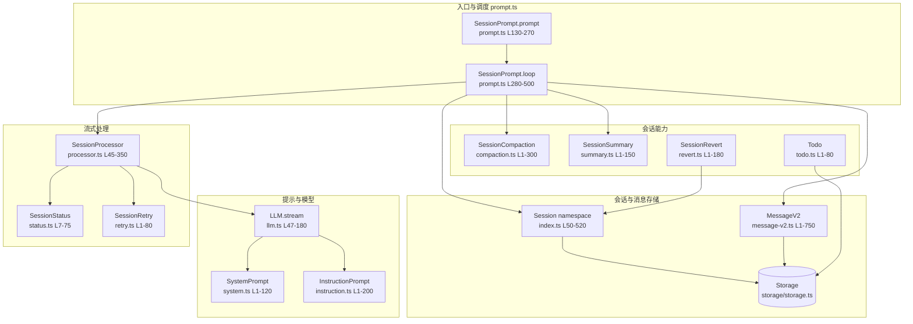
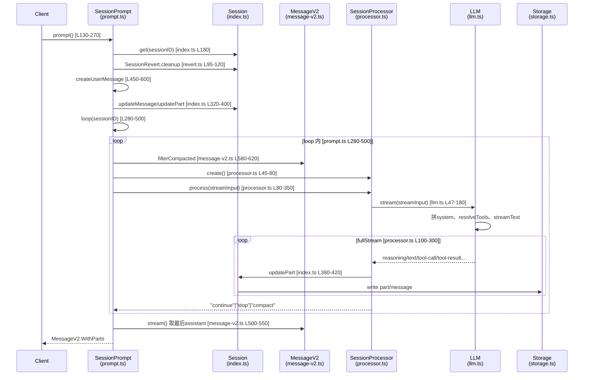
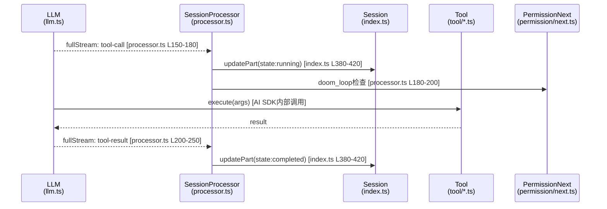
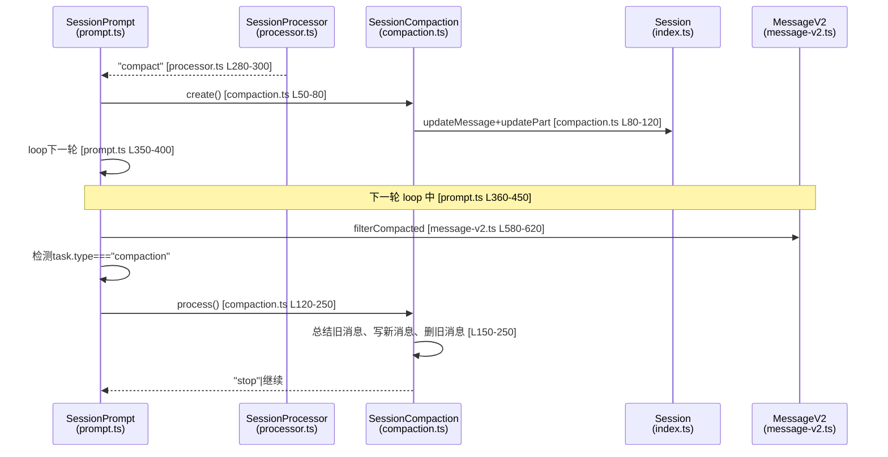
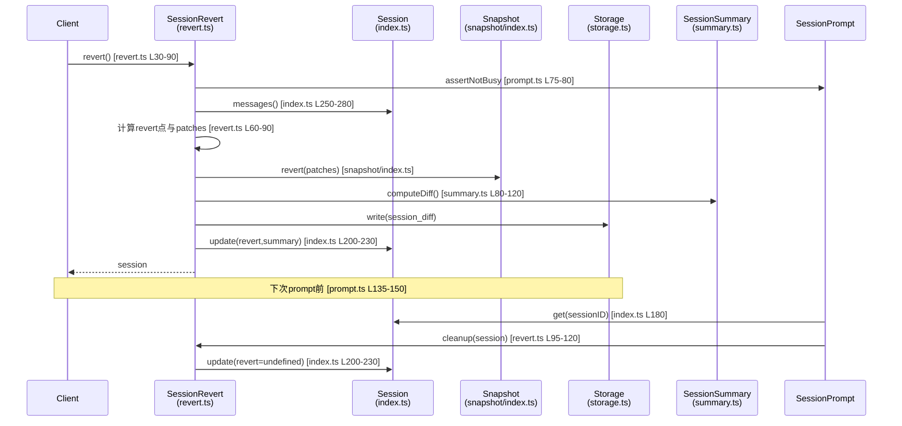
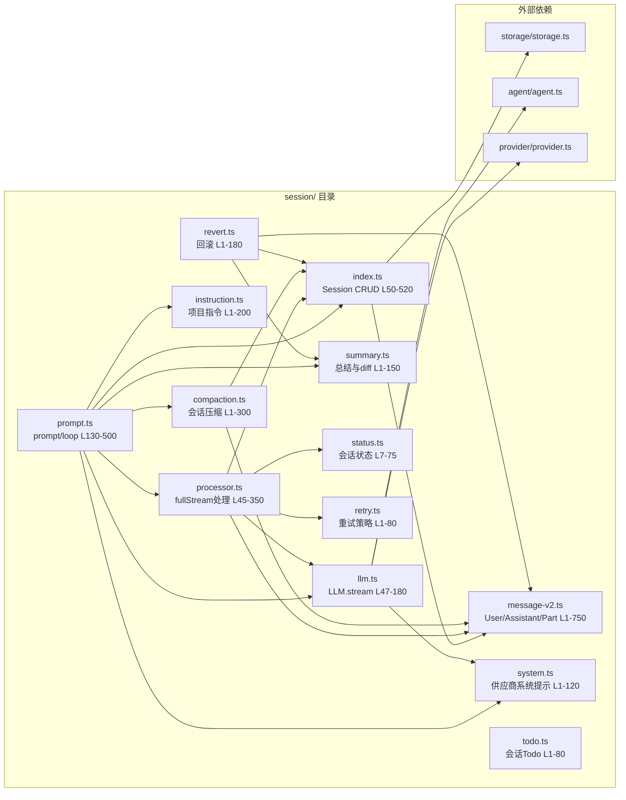

# Session 系统模块源码分析报告

## 1. 系统模块功能简介

Session 系统是 OpenCode 里**会话生命周期与消息流转**的统一定义与执行层，负责：

- **定义会话结构（Session.Info）**：id、slug、项目 ID、目录、父会话、标题、版本、时间戳、权限、分享、回滚等元数据；
- **维护会话 CRUD 与消息/Part 存储**：通过 Storage 持久化会话与消息，提供 `Session.create/get/update/remove`、`Session.messages`、`Session.updateMessage/updatePart/removeMessage/removePart` 等 API；
- **驱动一轮对话的完整流程**：从用户发起到 LLM 流式调用、工具调用与重试、会话压缩与总结、状态与事件发布（SessionPrompt.prompt/loop、SessionProcessor、LLM.stream）；
- **系统提示与运行环境**：按模型选择供应商专用系统提示、注入运行环境信息（SystemPrompt）；以及项目级指令文件解析与注入（InstructionPrompt）；
- **会话级能力**：分享/取消分享（share/unshare）、Fork（fork）、回滚/取消回滚（SessionRevert）、会话压缩（SessionCompaction）、自动标题与总结（SessionSummary）、忙闲与重试状态（SessionStatus、SessionRetry）、Todo 存储（Todo）等。

---

## 2. 系统架构图



**说明**：  
- **入口**：`SessionPrompt.prompt` 创建用户消息并进入 `SessionPrompt.loop`；`loop` 在单会话内循环处理「最后用户消息 → 解析 Agent/模型/工具 → SessionProcessor 调用 LLM.stream → 处理流事件、工具调用、重试」直到结束或需要压缩。  
- **存储**：Session 与 MessageV2 的读写均通过 Storage，路径形如 `session/{projectID}/{sessionID}`、`message/{sessionID}/{messageID}`、`part/{messageID}/{partID}`。  
- **提示**：SystemPrompt 提供按模型的供应商提示与环境信息；InstructionPrompt 提供项目/全局指令文件内容；二者与 Agent 的 prompt 一起在 LLM 中拼成 system 消息。  
- **流式与状态**：SessionProcessor 消费 LLM 的 fullStream，更新 Part/Message 并写回 Storage，同时通过 SessionStatus 表示 busy/retry/idle，失败时由 SessionRetry 决定是否重试。  
- **会话能力**：Compaction 在上下文溢出时做压缩或 prune；Summary 做消息总结与 diff；Revert 做回滚与 diff 展示；Todo 做会话级待办存储。

---

## 3. 源码目录结构

```
packages/opencode/src/session/
├── index.ts           # 核心：Session.Info、Event、create/get/update/remove、messages、fork、share、updateMessage/Part、getUsage、initialize
├── system.ts          # 系统提示：SystemPrompt.instructions/provider/environment
├── prompt.ts          # 会话驱动：SessionPrompt.prompt/loop、createUserMessage、resolveTools、command、shell、ensureTitle
├── llm.ts             # LLM 调用：LLM.stream、StreamInput/StreamOutput、resolveTools、hasToolCalls
├── processor.ts       # 流式处理：SessionProcessor.create、process(fullStream 事件与 Part 更新)
├── message.ts         # 旧版消息结构（Message.* Part/Info，部分仍被引用）
├── message-v2.ts      # 新版消息：MessageV2.User/Assistant/Part 及 toModelMessages、stream、filterCompacted 等
├── instruction.ts     # 项目/全局指令：InstructionPrompt.systemPaths/system/clear、AGENTS.md 等
├── compaction.ts      # 会话压缩：SessionCompaction.isOverflow/process/create/prune
├── summary.ts         # 会话总结与 diff：SessionSummary.summarize、computeDiff
├── status.ts          # 会话状态：SessionStatus.get/set/list、idle/busy/retry
├── retry.ts           # 重试策略：SessionRetry.sleep/delay/retryable
├── revert.ts          # 回滚：SessionRevert.revert/unrevert/cleanup
├── todo.ts            # 会话 Todo：Todo.Info、update、get、Event
└── prompt/            # 各供应商/场景的固定系统提示文本
    ├── anthropic.txt
    ├── anthropic-20250930.txt
    ├── qwen.txt
    ├── beast.txt
    ├── gemini.txt
    ├── codex_header.txt
    ├── copilot-gpt-5.txt
    ├── plan.txt
    ├── plan-reminder-anthropic.txt
    ├── build-switch.txt
    └── max-steps.txt
```

**重要文件简要说明**：

- **index.ts**：Session 命名空间唯一入口，定义 `Session.Info`、事件（Created/Updated/Deleted/Diff/Error）、会话 CRUD、messages/children、fork/touch、share/unshare、updateMessage/updatePart/removeMessage/removePart、getUsage、initialize、BusyError 等。
- **prompt.ts**：会话「一轮对话」的调度中心；`prompt()` 创建用户消息并进入 `loop()`；`loop()` 内解析最后 user/assistant、处理 subtask/compaction、调用 SessionProcessor.process、处理压缩与标题；还包含 createUserMessage（含 @file/@agent 解析）、resolveTools（ToolRegistry + MCP）、command/shell、ensureTitle。
- **llm.ts**：封装 `streamText`，拼 system（Agent 提示 + SystemPrompt + 自定义 + 环境），解析 tools、权限、LiteLLM 占位工具，调用 Provider/Config/Auth，返回 stream。
- **processor.ts**：根据 `LLM.stream` 的 fullStream 事件（reasoning/text/tool-call/tool-result/tool-error/finish-step 等）创建或更新 MessageV2 的 Part，写回 Session.updatePart/updateMessage，处理 doom_loop、重试与错误，返回 continue/stop/compact。
- **message-v2.ts**：定义 User/Assistant 及各类 Part（Text、Reasoning、File、Tool、StepStart/StepFinish、Patch、Snapshot、Agent、Subtask、Compaction、Retry），以及 toModelMessages、stream、filterCompacted、fromError 等。
- **system.ts**：按模型 ID 选择供应商专用系统提示（gpt-5→Codex，gpt-/o1/o3→Beast，gemini→Gemini，claude→Anthropic，其余→通用），并生成运行环境段落。
- **instruction.ts**：从项目或全局目录解析 AGENTS.md、CLAUDE.md 等，在 InstructionPrompt.system() 中拼成指令数组，供 LLM system 使用；clear(messageID) 用于清理某消息的 claim 状态。
- **compaction.ts**：判断 isOverflow（根据 token 与 model limit），process 执行压缩（总结旧消息并写入 compaction part），create 插入待压缩任务，prune 按 token 阈值裁剪旧 tool 输出。
- **summary.ts**：summarize 对指定 user message 触发总结（标题/正文/diff）；computeDiff 用于 revert 时的 diff 统计。
- **status.ts**：内存态会话状态（idle/busy/retry），通过 SessionStatus.set/get/list 与事件发布给 UI。
- **retry.ts**：判断错误是否可重试（retryable）、计算延迟（delay）、sleep；供 processor 在流错误时使用。
- **revert.ts**：按 message/part 定位回滚点，收集 patch、执行 Snapshot.revert、写 session.revert 与 session_diff，cleanup 在 prompt 前清理 revert 状态。
- **todo.ts**：会话维度的 Todo 列表存储与事件，与主流程解耦。
- **prompt/*.txt**：供应商或场景的固定系统提示片段，在 system.ts 或 prompt.ts 中被引用（如 plan/build-switch/max-steps）。

---

## 4. 核心数据结构

### 4.1 Session.Info（index.ts）

```ts
// packages/opencode/src/session/index.ts 约 51–92 行
export const Info = z
  .object({
    id: Identifier.schema("session"),
    slug: z.string(),
    projectID: z.string(),
    directory: z.string(),
    parentID: Identifier.schema("session").optional(),
    summary: z
      .object({
        additions: z.number(),
        deletions: z.number(),
        files: z.number(),
        diffs: Snapshot.FileDiff.array().optional(),
      })
      .optional(),
    share: z.object({ url: z.string() }).optional(),
    title: z.string(),
    version: z.string(),
    time: z.object({
      created: z.number(),
      updated: z.number(),
      compacting: z.number().optional(),
      archived: z.number().optional(),
    }),
    permission: PermissionNext.Ruleset.optional(),
    revert: z
      .object({
        messageID: z.string(),
        partID: z.string().optional(),
        snapshot: z.string().optional(),
        diff: z.string().optional(),
      })
      .optional(),
  })
  .meta({ ref: "Session" })
export type Info = z.output<typeof Info>
```

**说明**：  
- **id/slug**：会话唯一标识与短链用 slug。  
- **projectID/directory**：所属项目与工作目录。  
- **parentID**：用于子会话（fork 或层级会话）。  
- **summary**：可选的回滚/总结产生的统计（additions/deletions/files）及 diffs。  
- **share**：分享时的 URL。  
- **title/version**：展示用标题与创建时的安装版本。  
- **time**：created/updated，以及可选的 compacting/archived。  
- **permission**：会话级权限规则集，与 Agent 的 permission 合并后用于工具/任务权限。  
- **revert**：回滚点（messageID/partID）及回滚时的 snapshot/diff 信息。

### 4.2 MessageV2.User / MessageV2.Assistant（message-v2.ts）

```ts
// message-v2.ts 约 300–328、348–388 行
export const User = Base.extend({
  role: z.literal("user"),
  time: z.object({ created: z.number() }),
  summary: z.object({
    title: z.string().optional(),
    body: z.string().optional(),
    diffs: Snapshot.FileDiff.array(),
  }).optional(),
  agent: z.string(),
  model: z.object({ providerID: z.string(), modelID: z.string() }),
  system: z.string().optional(),
  tools: z.record(z.string(), z.boolean()).optional(),
  variant: z.string().optional(),
}).meta({ ref: "UserMessage" })

export const Assistant = Base.extend({
  role: z.literal("assistant"),
  time: z.object({ created: z.number(), completed: z.number().optional() }),
  error: z.discriminatedUnion("name", [AuthError.Schema, ...]).optional(),
  parentID: z.string(),
  modelID: z.string(),
  providerID: z.string(),
  mode: z.string(),  // @deprecated
  agent: z.string(),
  path: z.object({ cwd: z.string(), root: z.string() }),
  summary: z.boolean().optional(),
  cost: z.number(),
  tokens: z.object({
    input: z.number(),
    output: z.number(),
    reasoning: z.number(),
    cache: z.object({ read: z.number(), write: z.number() }),
  }),
  finish: z.string().optional(),
}).meta({ ref: "AssistantMessage" })
```

**说明**：  
- **User**：agent/model 指定本轮使用的 Agent 与模型；system 为自定义系统提示片段；tools 为工具开关（已与 permission 合并方向演进）；variant 用于模型变体；summary 用于总结结果。  
- **Assistant**：parentID 指向触发的 user 消息；agent/modelID/providerID 记录使用的模型；path 为执行时 cwd/root；cost/tokens 为本轮消耗；finish 为结束原因；error 为错误信息；summary 标记是否已参与总结。

### 4.3 MessageV2.Part 与 Tool 状态（message-v2.ts）

Part 为 discriminatedUnion，主要类型：  
- **TextPart / ReasoningPart**：文本与推理内容。  
- **FilePart**：附件（mime、url、source 等）。  
- **ToolPart**：工具调用，state 为 ToolStatePending | ToolStateRunning | ToolStateCompleted | ToolStateError（含 input、output、time、attachments 等）。  
- **StepStartPart / StepFinishPart**：步骤开始/结束与 token 统计。  
- **PatchPart / SnapshotPart**：文件变更与快照。  
- **AgentPart / SubtaskPart / CompactionPart / RetryPart**：@agent、子任务、压缩任务、重试记录。

### 4.4 LLM.StreamInput（llm.ts）

```ts
// llm.ts 约 31–41 行
export type StreamInput = {
  user: MessageV2.User
  sessionID: string
  model: Provider.Model
  agent: Agent.Info
  system: string[]
  abort: AbortSignal
  messages: ModelMessage[]
  small?: boolean
  tools: Record<string, Tool>
  retries?: number
}
```

**说明**：  
- 一次流式调用的完整入参：当前 user 消息、会话与模型与 Agent、额外 system 片段、历史 messages、工具表、是否 small 模型、重试次数与 abort。

### 4.5 SessionStatus.Info（status.ts）

```ts
// status.ts 约 7–25 行
export const Info = z.union([
  z.object({ type: z.literal("idle") }),
  z.object({
    type: z.literal("retry"),
    attempt: z.number(),
    message: z.string(),
    next: z.number(),
  }),
  z.object({ type: z.literal("busy") }),
]).meta({ ref: "SessionStatus" })
```

**说明**：  
- 会话运行时状态：idle / busy / retry（含 attempt、message、next 时间戳），用于 UI 与重试逻辑。

---

## 5. 核心场景时序图

### 5.1 用户发起对话到得到助手回复（prompt → loop → processor → LLM）



**说明**：  
- 入口：`SessionPrompt.prompt()`（prompt.ts），内部创建用户消息后调用 `SessionPrompt.loop(sessionID)`。  
- `loop` 中通过 `MessageV2.filterCompacted(MessageV2.stream(sessionID))` 取压缩后的消息列表，确定 lastUser/lastAssistant，再创建 SessionProcessor 并调用 `process(streamInput)`。  
- `SessionProcessor.process()` 调用 `LLM.stream(streamInput)`（llm.ts），并消费 fullStream，在 processor.ts 中根据事件类型调用 `Session.updatePart` / `Session.updateMessage`，数据落盘在 index.ts 的 Storage 写入。  
- 返回 "continue" 时 loop 继续下一轮；"stop" 或 "compact" 时退出或先创建压缩任务再继续。

### 5.2 工具调用与 Part 更新（processor 内）



**说明**：  
- 工具调用与结果均在 SessionProcessor.process() 的 for-await fullStream 中处理（processor.ts）：tool-call 时更新 Part 为 running，可选 doom_loop 询问；tool-result 时更新为 completed 并写入 output/attachments；tool-error 时更新为 error 并可能设置 blocked。  
- Session.updatePart 实现在 index.ts，写入 Storage 并发布 MessageV2.Event.PartUpdated。

### 5.3 会话压缩触发与执行（overflow → compaction）



**说明**：  
- 当 SessionProcessor 返回 "compact" 时，prompt.ts 的 loop 中调用 `SessionCompaction.create(...)`，向当前会话插入一个 CompactionPart（compaction.ts）。  
- 下一轮 loop 中，filterCompacted 会得到该 compaction 任务，然后调用 `SessionCompaction.process(...)` 执行真正的总结与消息替换（compaction.ts）；process 内部会读 messages、调用总结逻辑并写回新消息、清理旧消息。  
- isOverflow 在 processor 的 finish-step 和 prompt 的 loop 中都会被调用（processor.ts、prompt.ts），用于决定是否返回 "compact" 或直接 create 压缩任务。

### 5.4 回滚（revert）与清理



**说明**：  
- revert 入口在 revert.ts：`SessionRevert.revert({ sessionID, messageID, partID? })`，先 assertNotBusy，再取消息列表、确定回滚点和待 revert 的 patch，调用 Snapshot.revert、计算 diff、写 session_diff、更新 session.revert 和 summary。  
- cleanup 在 prompt.ts 的 prompt() 开头调用：`SessionRevert.cleanup(session)`，清除 session.revert，避免后续 loop 仍处于“回滚视图”。

---

## 6. 其他必要说明

### 6.1 事件总线（Session / MessageV2 / SessionStatus / SessionCompaction）

- **Session.Event**：Created、Updated、Deleted、Diff、Error（index.ts）。  
- **MessageV2.Event**：Updated、Removed、PartUpdated、PartRemoved（message-v2.ts）。  
- **SessionStatus.Event**：Status、Idle（status.ts）。  
- **SessionCompaction.Event**：Compacted（compaction.ts）。  

上述事件通过 `Bus.publish` 发布，供 UI、存储同步或其它模块订阅。

### 6.2 与 Agent / Provider / Tool 的边界

- **Agent**：Session 不维护 Agent 表，只在使用处通过 `Agent.get(name)` 获取；prompt/loop 中根据 lastUser.agent 取 Agent，并传入 LLM.stream 与 resolveTools。  
- **Provider**：模型与语言能力来自 Provider，LLM.stream 中通过 `Provider.getLanguage/getProvider`、`ProviderTransform.options` 等获取参数。  
- **Tool**：工具列表由 `ToolRegistry.tools()` 与 `MCP.tools()` 解析，在 prompt.ts 的 resolveTools 中合并；权限由 PermissionNext.merge(agent.permission, session.permission) 决定，LLM.resolveTools 会过滤被禁用的工具。

### 6.3 模块依赖关系简图



- **session/index** 依赖 message-v2 与 storage，是会话与消息存储的入口。  
- **prompt** 编排 loop、processor、llm、system、instruction、compaction、summary。  
- **processor** 依赖 llm、index、message-v2、status、retry。  
- **llm** 依赖 system、agent、provider。  
- **compaction**、**revert** 依赖 index、message-v2，summary 被 revert 用于 computeDiff。

以上为 Session 系统模块的源码分析报告，涵盖功能简介、架构图、目录结构、核心数据结构与核心场景时序及补充说明。
