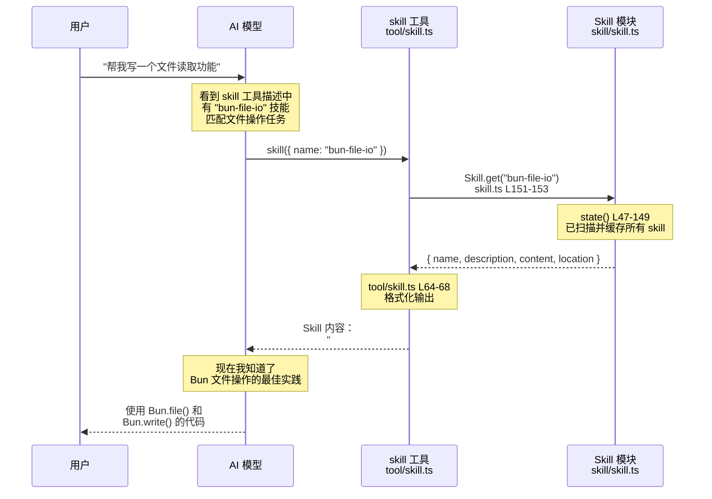

# 🎯 OpenCode Skill 系统完全指南

> Skill（技能）是一种让 AI 获取「专业知识」的机制

---

## 📌 一句话总结

```
Skill = 可复用的专业知识文档，AI 在需要时可以加载学习
```

---

## 🤔 Skill 是什么？

**Skill 就是一个 Markdown 文档**，包含：
- 专业领域的知识
- 特定任务的操作指南
- 项目特定的代码规范

当 AI 遇到匹配的任务时，会通过 `skill` 工具加载这个文档，获得相关的专业知识。

### 与其他概念的区别

| 概念 | 作用 | 加载时机 |
|------|------|---------|
| **System Prompt** | 定义 AI 的基础行为 | 每次对话都加载 |
| **AGENTS.md** | 项目级别的指令 | 每次对话都加载 |
| **Skill** | 特定任务的专业知识 | **按需加载**（AI 决定） |
| **Tool** | 执行具体操作的能力 | 每次都可用 |

**关键区别**：Skill 是**按需加载**的，不会占用基础 token。

---

## 📁 Skill 文件格式

### 文件位置

Skill 文件必须命名为 `SKILL.md`，可以放在以下位置：

```
项目目录/
├── .opencode/
│   └── skill/                    ← OpenCode 风格
│       └── my-skill/
│           └── SKILL.md
├── .claude/
│   └── skills/                   ← Claude Code 兼容风格
│       └── my-skill/
│           └── SKILL.md
└── ...

全局目录/
├── ~/.opencode/skill/            ← 全局 skill
│   └── my-skill/
│       └── SKILL.md
└── ~/.claude/skills/             ← Claude Code 全局 skill
    └── my-skill/
        └── SKILL.md
```

### 文件结构

```markdown
---
name: skill-name
description: 什么时候使用这个 skill 的描述
---

## 正文内容

这里写具体的知识和指南...
```

### 真实示例

```markdown
---
name: bun-file-io
description: Use this when you are working on file operations like reading, writing, scanning, or deleting files.
---

## Use this when

- Editing file I/O or scans in `packages/opencode`
- Handling directory operations or external tools

## Bun file APIs

- `Bun.file(path)` is lazy; call `text`, `json`, `stream` to read.
- `Bun.write(dest, input)` writes strings, buffers, Blobs.
- `Bun.Glob` + `Array.fromAsync(glob.scan(...))` for scans.

## Quick checklist

- Use Bun APIs first.
- Use `path.join`/`path.resolve` for paths.
```

---

## 🔄 Skill 工作流程



---

## 📝 代码解析

### 1. Skill 信息结构 (`skill/skill.ts` L17-23)

```typescript
export const Info = z.object({
  name: z.string(),        // skill 的唯一标识符
  description: z.string(), // 描述（告诉 AI 什么时候用）
  location: z.string(),    // 文件路径
  content: z.string(),     // Markdown 正文内容
})
```

### 2. Skill 扫描逻辑 (`skill/skill.ts` L47-149)

```typescript
export const state = Instance.state(async () => {
  const skills: Record<string, Info> = {}

  // 扫描 .claude/skills/ 目录
  for (const dir of claudeDirs) {
    for (const match of CLAUDE_SKILL_GLOB.scan({ cwd: dir })) {
      await addSkill(match)
    }
  }

  // 扫描 .opencode/skill/ 目录
  for (const dir of await Config.directories()) {
    for (const match of OPENCODE_SKILL_GLOB.scan({ cwd: dir })) {
      await addSkill(match)
    }
  }

  // 扫描配置中指定的额外路径
  for (const skillPath of config.skills?.paths ?? []) {
    // ...
  }

  return skills
})
```

**扫描优先级**：
1. 项目 `.claude/skills/`
2. 全局 `~/.claude/skills/`
3. 项目 `.opencode/skill/`
4. 配置文件中指定的路径

### 3. Skill 工具定义 (`tool/skill.ts`)

```typescript
export const SkillTool = Tool.define("skill", async (ctx) => {
  const skills = await Skill.all()

  // 根据权限过滤可用的 skill
  const accessibleSkills = agent
    ? skills.filter((skill) => {
        const rule = PermissionNext.evaluate("skill", skill.name, agent.permission)
        return rule.action !== "deny"
      })
    : skills

  // 生成工具描述（包含所有可用 skill 列表）
  const description = [
    "Load a skill to get detailed instructions for a specific task.",
    "<available_skills>",
    ...accessibleSkills.flatMap((skill) => [
      `  <skill>`,
      `    <name>${skill.name}</name>`,
      `    <description>${skill.description}</description>`,
      `  </skill>`,
    ]),
    "</available_skills>",
  ].join(" ")

  return {
    description,
    parameters: z.object({
      name: z.string().describe("The skill identifier"),
    }),
    async execute(params, ctx) {
      const skill = await Skill.get(params.name)
      // 返回 skill 内容给 LLM
      return {
        title: `Loaded skill: ${skill.name}`,
        output: skill.content,
        metadata: { name: skill.name },
      }
    },
  }
})
```

---

## 💡 Skill vs Tool 的关系

```
┌─────────────────────────────────────────────────────────────────┐
│                    Skill 和 Tool 的关系                         │
├─────────────────────────────────────────────────────────────────┤
│                                                                 │
│  Tool（工具）= 执行能力                                          │
│    - read: 读取文件                                              │
│    - edit: 编辑文件                                              │
│    - bash: 执行命令                                              │
│    - skill: 加载技能文档  ← Skill 通过这个工具被加载             │
│                                                                 │
│  Skill（技能）= 专业知识                                         │
│    - bun-file-io: Bun 文件操作最佳实践                          │
│    - react-patterns: React 组件编写规范                         │
│    - git-workflow: Git 工作流程指南                             │
│                                                                 │
│  AI 使用 skill 工具来加载 Skill 文档                            │
│                                                                 │
└─────────────────────────────────────────────────────────────────┘
```

---

## 🛠️ 创建自己的 Skill

### 步骤 1：创建目录和文件

```bash
mkdir -p .opencode/skill/my-skill
touch .opencode/skill/my-skill/SKILL.md
```

### 步骤 2：编写 Skill 内容

```markdown
---
name: my-skill
description: Use this when you need to [描述使用场景]
---

## When to use

- 场景 1
- 场景 2

## Guidelines

详细的指南内容...

## Examples

示例代码或操作步骤...

## Checklist

- [ ] 检查项 1
- [ ] 检查项 2
```

### 步骤 3：验证

重启 OpenCode 或刷新，AI 应该能在工具描述中看到你的 skill。

---

## 📊 关键代码位置速查

| 功能 | 文件 | 行号 |
|------|------|------|
| Skill 信息结构 | `skill/skill.ts` | L17-23 |
| 扫描目录配置 | `skill/skill.ts` | L43-45 |
| 扫描并加载 skill | `skill/skill.ts` | L47-149 |
| 获取单个 skill | `skill/skill.ts` | L151-153 |
| 获取所有 skill | `skill/skill.ts` | L155-157 |
| skill 工具定义 | `tool/skill.ts` | L7-80 |
| 权限过滤 | `tool/skill.ts` | L11-17 |
| 执行加载 | `tool/skill.ts` | L50-78 |

---

## 🔧 配置选项

在 `opencode.json` 中可以配置额外的 skill 路径：

```json
{
  "skills": {
    "paths": [
      "~/my-global-skills",
      "./custom-skills"
    ]
  }
}
```

---

## 🤔 常见问题

### Q: Skill 和 AGENTS.md 有什么区别？

**A:**
- **AGENTS.md**: 每次对话都会加载，是基础指令
- **Skill**: 按需加载，AI 决定是否需要

### Q: AI 怎么知道要加载哪个 Skill？

**A:** `skill` 工具的 `description` 中包含所有可用 skill 的列表和描述。AI 根据用户的任务和 skill 的描述来判断是否需要加载。

### Q: 可以禁用某些 Skill 吗？

**A:** 可以通过权限配置来禁用：
```json
{
  "permission": {
    "skill": {
      "some-skill-name": "deny"
    }
  }
}
```

### Q: Skill 会占用 token 吗？

**A:** 只有被加载时才会占用。skill 列表（名称+描述）会包含在工具描述中，但具体内容只有在 AI 调用 `skill` 工具时才会加载。

---

## 📚 推荐学习顺序

1. **先看** 示例 skill：`.opencode/skill/bun-file-io/SKILL.md`
2. **再看** skill 模块：`skill/skill.ts`（理解扫描和加载逻辑）
3. **然后看** skill 工具：`tool/skill.ts`（理解如何暴露给 AI）
4. **最后** 尝试创建自己的 skill

---

*文件位置：packages/opencode/src/skill/SKILL_SYSTEM_GUIDE.md*
