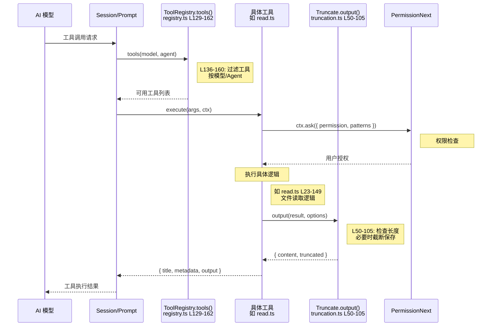
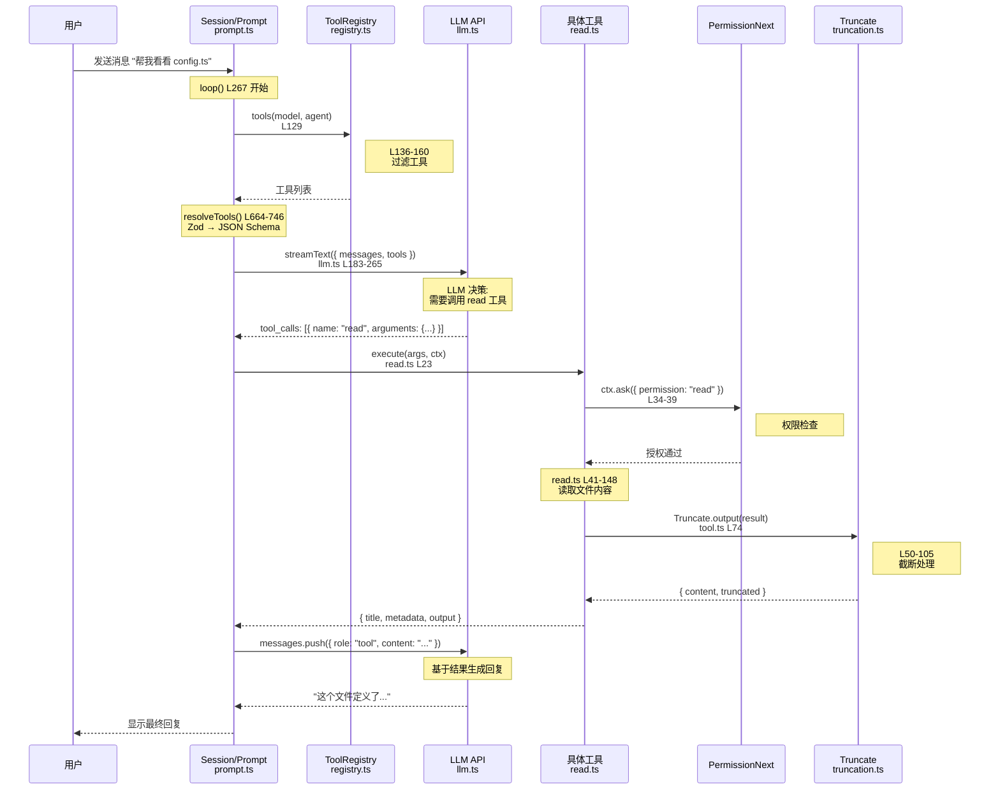
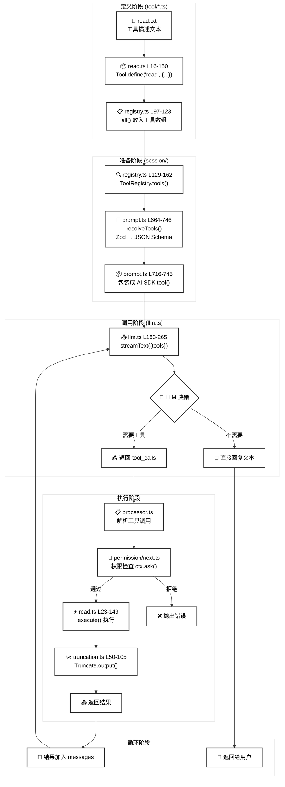

# 🔧 OpenCode 工具系统完全指南

> 帮助你快速理解工具的定义、注册和调用流程

## 📌 一句话总结

```
定义工具 → 注册到列表 → 转换为 JSON Schema 发给 LLM → LLM 决定调用 → 执行并返回结果
```

---

## 🎯 第一步：定义工具 (Tool Definition)

### 位置：各个 `tool/*.ts` 文件

每个工具用 `Tool.define()` 创建：

```typescript
// 文件：tool/todo.ts

export const TodoReadTool = Tool.define(
  "todoread",           // ① 工具ID（唯一标识）
  {
    description: "...", // ② 描述（告诉LLM这个工具干什么）
    parameters: z.object({...}),  // ③ 参数定义（LLM需要传什么）
    async execute(params, ctx) {  // ④ 执行逻辑（实际干活的代码）
      // 做事情...
      return { title, output, metadata }
    }
  }
)
```

### 简化理解

```
Tool.define = 创建一个工具的「配方」

配方包含：
  - 名字：叫什么
  - 说明书：什么时候用、怎么用
  - 输入要求：需要什么参数
  - 执行逻辑：具体怎么做
```

---

## 🎯 第二步：注册工具 (Tool Registration)

### 位置：`tool/registry.ts`

**注意：这里说的「注册」其实是「收集」—— 把所有工具放到一个列表里**

```typescript
// 文件：tool/registry.ts

import { ReadTool } from "./read"      // ← 第1步：导入工具
import { EditTool } from "./edit"
import { BashTool } from "./bash"
// ...

// 内置工具列表（硬编码在数组里）
async function all(): Promise<Tool.Info[]> {
  return [
    InvalidTool,      // 处理无效调用
    QuestionTool,     // 向用户提问
    BashTool,         // 执行命令
    ReadTool,         // ← 第2步：放入列表，这就是「注册」
    GlobTool,         // 文件搜索
    GrepTool,         // 内容搜索
    EditTool,         // 编辑文件
    WriteTool,        // 写入文件
    TaskTool,         // 调用子Agent
    TodoWriteTool,    // 写Todo
    TodoReadTool,     // 读Todo
    // ... 更多工具
    ...custom,        // 自定义工具（插件）
  ]
}
```

### 简化理解

```
ToolRegistry = 工具仓库

「注册」就是两步：
  1. import { ReadTool } from "./read"  ← 导入
  2. 把 ReadTool 放进 all() 返回的数组 ← 加入列表

就这么简单！没有复杂的注册函数。
```

---

## 🎯 第二点五步：以 ReadTool 为例的完整追踪

### 📁 read.ts 中定义工具

```typescript
// tool/read.ts

import DESCRIPTION from "./read.txt"   // 描述文本

export const ReadTool = Tool.define("read", {
  description: DESCRIPTION,            // 工具描述
  parameters: z.object({               // 参数定义（Zod Schema）
    filePath: z.string().describe("The path to the file to read"),
    offset: z.coerce.number().describe("The line number to start reading from").optional(),
    limit: z.coerce.number().describe("The number of lines to read").optional(),
  }),
  async execute(params, ctx) {         // 执行逻辑
    // ... 读取文件的代码
    return { title, output, metadata }
  },
})
```

### 📁 registry.ts 中「注册」（就是放进数组）

```typescript
// tool/registry.ts

import { ReadTool } from "./read"   // 导入

async function all() {
  return [
    // ...
    ReadTool,   // ← 放进数组，注册完成！
    // ...
  ]
}
```

### 📁 prompt.ts 中获取并转换格式

```typescript
// session/prompt.ts 的 resolveTools 函数（第 711-746 行）

// 第1步：从 registry 获取所有工具
for (const item of await ToolRegistry.tools(model, agent)) {
  
  // 第2步：把 Zod Schema 转换成 JSON Schema
  const schema = z.toJSONSchema(item.parameters)
  //            ↑ Zod 内置方法，转换格式
  
  // 第3步：包装成 AI SDK 需要的格式
  tools[item.id] = tool({
    id: item.id,                      // "read"
    description: item.description,    // read.txt 的内容
    inputSchema: jsonSchema(schema),  // JSON Schema 格式的参数定义
    execute: async (args) => {        // 执行函数
      return await item.execute(args, ctx)
    }
  })
}
```

### 📁 llm.ts 中发送给 LLM

```typescript
// session/llm.ts 第 183-243 行

streamText({
  messages: [...],
  tools,        // ← 这里！工具列表发送给 LLM
})
```

---

## 🔄 完整流程图（以 ReadTool 为例）

```
┌─────────────────────────────────────────────────────────────────────────────┐
│                    ReadTool 从定义到发送给 LLM 的完整路径                     │
└─────────────────────────────────────────────────────────────────────────────┘

┌──────────────────────┐
│  tool/read.txt       │  "Reads a file from the local filesystem..."
└──────────┬───────────┘
           │ import
           ▼
┌──────────────────────┐
│  tool/read.ts        │  Tool.define("read", {
│                      │    description: DESCRIPTION,  ← 来自 read.txt
│                      │    parameters: z.object({...}),
│                      │    execute: async () => {...}
│                      │  })
└──────────┬───────────┘
           │ export ReadTool
           ▼
┌──────────────────────┐
│  tool/registry.ts    │  import { ReadTool } from "./read"
│                      │  
│                      │  all() { return [..., ReadTool, ...] }
└──────────┬───────────┘
           │ ToolRegistry.tools()
           ▼
┌──────────────────────┐
│  session/prompt.ts   │  for (item of ToolRegistry.tools()) {
│  resolveTools()      │    schema = z.toJSONSchema(item.parameters)
│                      │    tools[item.id] = tool({
│                      │      description: item.description,
│                      │      inputSchema: jsonSchema(schema)
│                      │    })
│                      │  }
└──────────┬───────────┘
           │ tools 对象
           ▼
┌──────────────────────┐
│  session/llm.ts      │  streamText({
│  stream()            │    messages: [...],
│                      │    tools: {            ← LLM 收到的格式
│                      │      read: {
│                      │        description: "Reads a file...",
│                      │        parameters: {
│                      │          type: "object",
│                      │          properties: {
│                      │            filePath: { type: "string", ... },
│                      │            offset: { type: "number", ... },
│                      │            limit: { type: "number", ... }
│                      │          }
│                      │        }
│                      │      }
│                      │    }
│                      │  })
└──────────────────────┘
           │
           ▼
      🤖 LLM API
```

---

## 📝 LLM 最终收到的 ReadTool 格式

```json
{
  "name": "read",
  "description": "Reads a file from the local filesystem. You can access any file directly by using this tool.\nAssume this tool is able to read all files on the machine...",
  "parameters": {
    "type": "object",
    "properties": {
      "filePath": {
        "type": "string",
        "description": "The path to the file to read"
      },
      "offset": {
        "type": "number",
        "description": "The line number to start reading from (0-based)"
      },
      "limit": {
        "type": "number",
        "description": "The number of lines to read (defaults to 2000)"
      }
    },
    "required": ["filePath"]
  }
}
```

这就是 LLM 看到的「read 工具说明书」！

---

## 🎯 第三步：转换并发送给 LLM

### 位置：`session/prompt.ts` → `session/llm.ts`

```typescript
// 文件：session/prompt.ts 的 resolveTools 函数

async function resolveTools(input) {
  const tools: Record<string, AITool> = {}
  
  // 遍历所有工具
  for (const item of await ToolRegistry.tools(...)) {
    // 把 Zod schema 转换成 JSON Schema
    const schema = z.toJSONSchema(item.parameters)
    
    // 包装成 AI SDK 需要的格式
    tools[item.id] = tool({
      id: item.id,
      description: item.description,
      inputSchema: jsonSchema(schema),
      async execute(args, options) {
        // 调用我们定义的 execute 函数
        return await item.execute(args, ctx)
      }
    })
  }
  
  return tools
}
```

### 发送给 LLM

```typescript
// 文件：session/llm.ts

streamText({
  model: language,
  messages: [...],          // 对话历史
  tools: resolvedTools,     // ← 工具列表在这里传给 LLM
  // ...
})
```

### 简化理解

```
1. 从仓库取出所有工具
2. 把每个工具的参数定义转换成 JSON Schema
3. 连同工具描述一起发送给 LLM

LLM 收到的大概是这样：

{
  "tools": [
    {
      "name": "read",
      "description": "读取文件内容",
      "parameters": {
        "type": "object",
        "properties": {
          "filePath": { "type": "string", "description": "文件路径" }
        }
      }
    },
    // ... 更多工具
  ]
}
```

---

## 🎯 第四步：LLM 决定调用工具

### LLM 的思考过程

```
用户说："帮我看看 config.ts 的内容"

LLM 思考：
  - 用户想看文件内容
  - 我有一个 "read" 工具可以读取文件
  - 让我调用它

LLM 返回：
{
  "tool_calls": [{
    "name": "read",
    "arguments": {
      "filePath": "config.ts"
    }
  }]
}
```

---

## 🎯 第五步：执行工具并返回结果

### 位置：`session/processor.ts` 处理 LLM 返回的工具调用

```typescript
// 简化的执行流程

// 1. LLM 返回工具调用请求
const toolCall = {
  name: "read",
  arguments: { filePath: "config.ts" }
}

// 2. 找到对应的工具
const tool = tools["read"]

// 3. 验证参数（Zod）
tool.parameters.parse(toolCall.arguments)

// 4. 执行工具
const result = await tool.execute(toolCall.arguments, context)
// result = { title: "config.ts", output: "文件内容...", metadata: {...} }

// 5. 把结果发回给 LLM
messages.push({
  role: "tool",
  content: result.output
})

// 6. LLM 继续处理...
```

---

## 📊 完整流程图

### ASCII 简化版

```
┌─────────────────────────────────────────────────────────────────┐
│                        工具系统流程图                            │
└─────────────────────────────────────────────────────────────────┘

┌──────────────┐
│ 1. 定义工具   │  Tool.define("read", { description, parameters, execute })
└──────┬───────┘
       │
       ▼
┌──────────────┐
│ 2. 注册工具   │  ToolRegistry 维护工具列表
└──────┬───────┘
       │
       ▼
┌──────────────┐
│ 3. 转换格式   │  Zod Schema → JSON Schema
└──────┬───────┘
       │
       ▼
┌──────────────┐
│ 4. 发送给LLM  │  tools 参数包含所有可用工具
└──────┬───────┘
       │
       ▼
┌──────────────┐
│ 5. LLM决策   │  根据用户请求决定是否调用工具
└──────┬───────┘
       │
       ▼
┌──────────────┐
│ 6. 执行工具   │  调用 execute 函数，传入参数
└──────┬───────┘
       │
       ▼
┌──────────────┐
│ 7. 返回结果   │  结果发回给 LLM 继续处理
└──────────────┘
```

### Mermaid 时序图（工具调用完整流程）



### Mermaid 时序图（完整对话流程）



### Mermaid 流程图（简化版）



### 关键代码位置对照

| 流程步骤 | 文件 | 行号 | 函数/代码 |
|---------|------|------|----------|
| 定义工具 | `tool/read.ts` | 16-150 | `Tool.define("read", {...})` |
| 注册工具 | `tool/registry.ts` | 97-123 | `all()` 返回工具数组 |
| 获取工具 | `tool/registry.ts` | 129-162 | `tools(model, agent)` |
| 转换格式 | `session/prompt.ts` | 711-746 | `resolveTools()` |
| 发送 LLM | `session/llm.ts` | 183-265 | `streamText({tools})` |
| 权限检查 | `permission/next.ts` | - | `PermissionNext.ask()` |
| 执行工具 | `tool/read.ts` | 23-149 | `execute(params, ctx)` |
| 输出截断 | `tool/truncation.ts` | 50-105 | `Truncate.output()` |

---

## 🔑 关键文件速查

| 文件 | 作用 |
|------|------|
| `tool/tool.ts` | Tool.define() 定义，工具的基础框架 |
| `tool/registry.ts` | 工具注册表，管理所有工具 |
| `tool/*.ts` | 具体工具实现（read、edit、bash等） |
| `session/prompt.ts` | resolveTools() 准备工具列表 |
| `session/llm.ts` | 调用 LLM API，传入工具 |
| `session/processor.ts` | 处理 LLM 返回的工具调用 |

---

## 💡 创建新工具的最简示例

```typescript
// 文件：tool/hello.ts

import z from "zod"
import { Tool } from "./tool"

export const HelloTool = Tool.define("hello", {
  // 1. 描述：告诉 LLM 什么时候用这个工具
  description: "Say hello to someone",
  
  // 2. 参数：定义需要什么输入
  parameters: z.object({
    name: z.string().describe("The name to greet"),
  }),
  
  // 3. 执行：实际的处理逻辑
  async execute(params, ctx) {
    const greeting = `Hello, ${params.name}!`
    
    return {
      title: `Greeted ${params.name}`,  // UI 显示的标题
      output: greeting,                  // 发给 LLM 的结果
      metadata: { name: params.name },   // 额外数据
    }
  },
})
```

然后在 `registry.ts` 的 `all()` 函数中添加：

```typescript
import { HelloTool } from "./hello"

// ...
return [
  // ... 其他工具
  HelloTool,  // ← 添加这行
]
```

---

## 🤔 常见问题

### Q: 为什么用 Zod？

**A:** Zod 一石三鸟：
1. **运行时验证**：确保 LLM 返回的参数格式正确
2. **生成 JSON Schema**：自动转换成 LLM 能理解的格式
3. **类型推断**：TypeScript 自动知道参数类型

### Q: ctx.ask() 是干什么的？

**A:** 权限检查。在执行敏感操作前询问用户是否允许：
```typescript
await ctx.ask({
  permission: "edit",      // 权限类型
  patterns: [filePath],    // 要操作的目标
})
// 如果用户拒绝，会抛出错误，工具不会执行
```

### Q: Tool.define 的第二个参数为什么有时是函数，有时是对象？

**A:** 两种写法都可以：
```typescript
// 写法1：直接传对象（静态配置）
Tool.define("id", { description, parameters, execute })

// 写法2：传函数（动态配置，可以根据 agent 等信息调整）
Tool.define("id", async (ctx) => {
  // ctx.agent 可以获取当前 agent 信息
  return { description, parameters, execute }
})
```

---

## 📚 推荐学习顺序

1. **先看** `tool/todo.ts` - 最简单的工具实现
2. **再看** `tool/tool.ts` - 理解 Tool.define 做了什么
3. **然后看** `tool/registry.ts` - 理解工具如何被收集
4. **最后看** `tool/read.ts` 或 `tool/edit.ts` - 复杂工具的实现

---

*文件位置：packages/opencode/src/tool/TOOL_SYSTEM_GUIDE.md*
